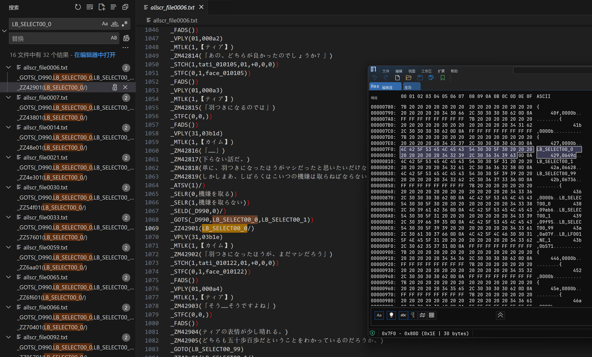
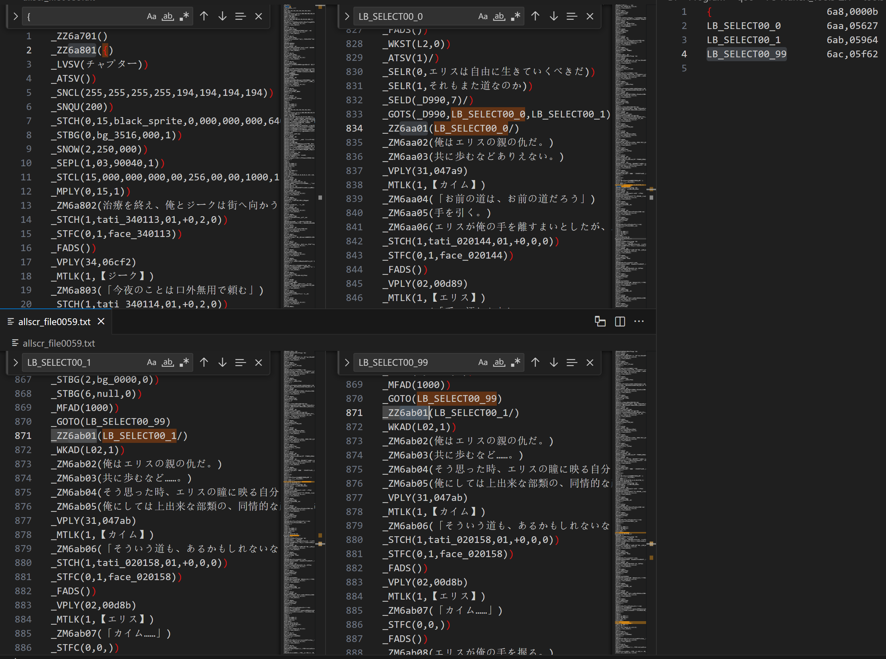
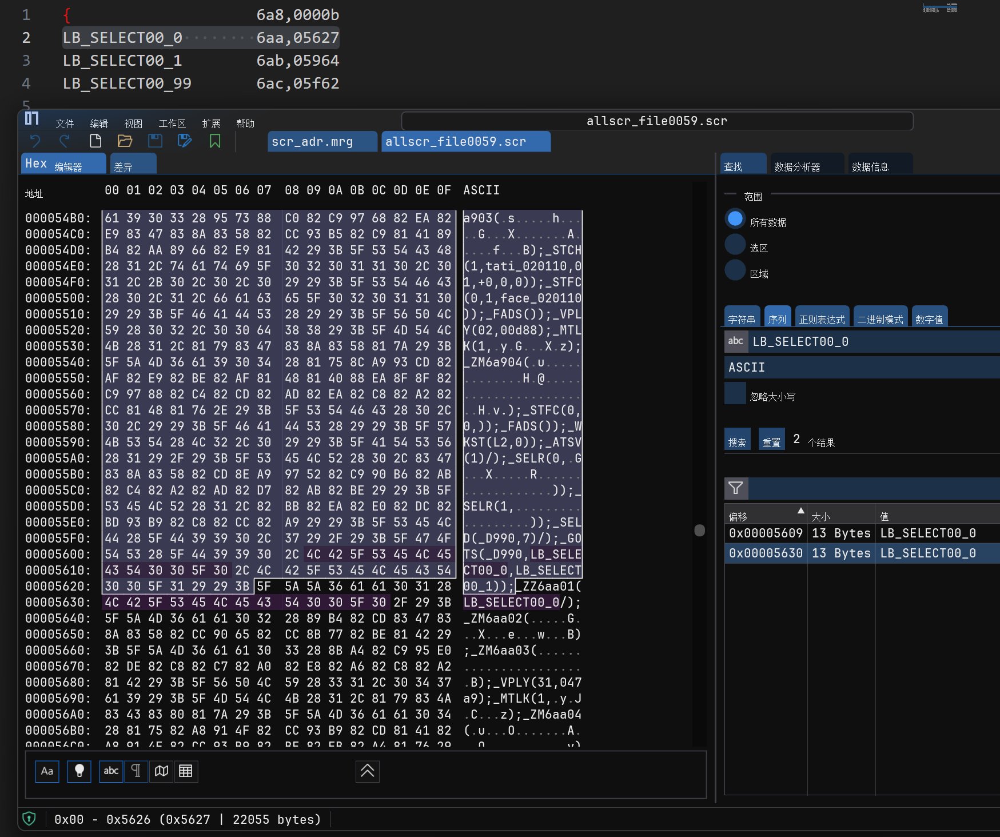

# hunex引擎汉化分析笔记(3): scr脚本分析及其文本提取与修改

......

前面我们提到，allscr.mrg中开头先存有三个未知文件、之后才是scr脚本，从数据内容来分析可以大致看出前三个分别是nam、mrg、mzp性质的文件，不过在其他同样引擎移植的游戏中、allscr.mrg开头只存有一个mrg文件，这里以 **秽翼的尤斯蒂娅**(以下简称脏翅膀) 为例，查看allscr开头的这个mrg文件的数据，和单个mrg的结构基本一致、也能直接解包，那就看看entry内容处存了什么东东，能看到很明显的ASCII明文，把一些像tag的在scr的内容中对比搜一搜，果真能找到一些相同名且用在脚本中的tag： 能看到这个mrg中记录的信息都是以`TAG名  3位hex值,5位hex值`的形式逐一记录，那说不定这个文件中记录的信息有可能和前面遇到的scr文本大小修改限制的问题有关？

通过后续在对fha文件的分析中，发现fsn和fha的allscr.mrg中前两个文件实际文件名为`scr.nam`和`scr_adr.mrg`，那十有八九scr_adr.mrg记录的就是每个scr脚本的偏移位和偏移量了，对比一下scr_adr.mrg的entry-num，数量刚好和allscr中实际用到的scr脚本数量一致，试着按照各个scr在allscr中的文件名顺序给scr_adr.mrg解出来的entry数据块依序进行命名，能巧妙的发现实则每个scr_adr的数据块记录的TAG信息都刚好对应相应scr中用在ZZ指令上的参数TAG，这里拿脏翅膀的第59个scr为例： 这里把ZZ指令分解为

`ZZ + 3位hex顺序号(应该是区分章节的大序号) + 2位hex顺序值(应该是区分文本行的小序号)`

那每个scr_adr信息记录的应该是

`当前scr在ZZ指令中用到的TAG    ZZ指令的3位hex序号,未知量`

接下来头疼的就是剩下的未知量，很明显是某种东西的大小，是当前scr数据的大小？那又不可能一个tag就记一次，而且很明显逐个tag记录的未知量是递增的，是从第一个scr数据/当前scr开头到这个tag的偏移量？但是多少又还差一点。最终通过反复比对，还是发现了这个所谓的未知量，其实是**当前scr用到了这个tag的ZZ指令段头**到**当前scr开头**的数据偏移量，例如这一段`_ZZ6aa01(LB_SELECT00_0/)`在scr数据中的偏移量就是`0x5627 bytes`： 最终的scr_adr中记录的每个信息格式是：

`当前scr在ZZ指令中用到的TAG    ZZ指令的3位hex序号,ZZ指令所在段偏移量`

由此推断，原来游戏是通过这种形式记录这些scr章节标记/跳转标记的tag在每个scr中的相对偏移位置、来巧妙实现了剧情间的跳转和节点检查的，并非强行写死了每个scr脚本数据的大小。通过对scr_adr.mrg中各个tag偏移信息的简单修改和测试，也实现了scr脚本数据内容大小的可变长修改，关于scr_adr的解析就到这里。

......
