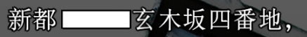
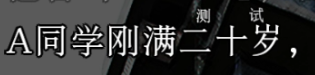
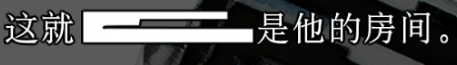

## 这里简单记录一些汉化Fate KAG类脚本（如krkr的ks）文本中会穿插使用到的常见宏指令

*以下内容仅供内部个人汉化交流参考用*

在文本中，用`[]`括住的指令内容即为文本宏指令，其指令效果和KAG中单独使用的宏指令行功能效果相同

在校译中，推荐修改的有：

1. `[line len=N]`或`[lineN]` 绘制显示指定数量N的破折号
2. `[block len=N]` 绘制指定数量N的连续方形块： 
3. `[ruby text=XX char=N]YYY` 在指定数量N(N>1)的文字YYY上方绘制ruby小字(XX)注解，当要加注解的文字数量为1时通常会写成`[ruby text=XX]Y`并省略掉`char=N`参数，如图这个示例`A同学刚满[ruby text=测试 char=3]二十岁`就是在`二十岁`这三个文字上方区域绘制`测试`这个小字注解： 
4. `XX[br]YY`或`XX[r]YY` 文本绘制显示时到YY直接换行(CRLF)，对于psv版的hunex引擎为了美观显示可能会常用到

以上宏指令可以根据实际翻译需求任意更改参数和文本中的使用位置。

其他会出现但不推荐轻易改动所在位置及用法的：

1. `[lr]` 结束并等待点击后换行符号，通常是在每行文末，如果在文本中间出现使用的话可以反馈一下 
2. `[font color=0xNNNNNN]` 指定字体颜色绘制文本
3. `[font italic=1]` 指定字体斜体绘制文本
4. `[wacky len=N]` 绘制指定长度N的异形块，似乎没有什么改动参数的必要，如`[wacky len=5]`效果： 
5. `[xxx]` 其他的大部分指令多数和文本演出没有太多关系，固然不推荐改动里面的参数和大致使用位置，由于重置版引擎使用到的部分KAG宏指令是修改过的、和Krkr引擎的KAG宏指令存在部分差异，若有差异且没有在上面列出的，推荐修改为psv日文原版中用到的指令，如：

|psv日文|重置版官中|
|---|---|
|「皆さん窓辺の幽霊って知ってますか？\[waitvoice time=8000\]\[movefg textoff=0 storage=蒔寺私服01g(中)]　二学期から広まりだしたうわさなんですけど……」|“大家知道窗边的幽灵吗？\[cacheimage storage=蒔寺私服01g(中)\]\[wvl\]\[movefg textoff=0 storage=蒔寺私服01g(中)\]　从第二学期开始，这件事情就传开了……”|

- 可以看到官中相比起psv版多了cacheimage和wvl两个宏指令，wvl可以猜到是waitvoice某种变体，但由于psv版本中都没有这些宏指令，所以汉化和校汉对时推荐一并将官中用到的psv日文版中没有的宏指令去除并直接替换为日文中用到的宏指令：

|psv日文|修改过后的官中|
|---|---|
|「皆さん窓辺の幽霊って知ってますか？\[waitvoice time=8000\]\[movefg textoff=0 storage=蒔寺私服01g(中)]　二学期から広まりだしたうわさなんですけど……」|“大家知道窗边的幽灵吗？\[waitvoice time=8000\]\[movefg textoff=0 storage=蒔寺私服01g(中)]　从第二学期开始，这件事情就传开了……”|

以上只是整理收集了目前我所知道的，还有其他的疑惑或者其他要补充的指令都可以在群里提出来或联系我指正。
