# 基于Steins;Gate psv汉化分析的Mages 科学系汉化学习

端午期间看到了石头门新作的消息，想起来25年趁着周年纪念在steam促销购买的石头门本篇还在库里吃灰，于是决定入坑玩玩，但平时工作通勤都比较繁忙、还是想在一个较为便携的设备上本地游玩，自己也没有类似steamdeck这样比较方便的pc系统掌机，想起psv的本篇还没汉化，于是决定自己试着移植pc官中到psv、顺便入门学习一下Mages家科学系引擎的汉化方法。

## 1.游戏文件内容与封包格式分析

其实到26年的今天，Mages的科学系列的游戏引擎分析和汉化制作工具都已经相当成熟了，在PC端也有国外大佬组织[Committee of Zero](https://sonome.dareno.me/)制作的各种历史项目和文档可供学习研究了，PC端的分析就简单介绍一下。这里推荐一下B站up主**暮光暗愈者**的这篇文章[MAGES引擎游戏资源提取方法指北](https://www.bilibili.com/opus/782595981330874391)，里面将过往大部分Mages游戏涉及到的素材格式和使用引擎及相关分析工具等信息都进行了总结，个人觉得算是入门了解学习Mages游戏构成的一篇比较好的文章。

从steamdb可以查到，石头门Steam版的各个语言版本是独立的，咱在国区下的版本就直接是简体中文版了，由于剧情脚本里主机平台的指令多少可能与pc平台有差异，为了能对照比较psv的日文原文素材，这里也是有必要通过不同的Depot ID下载Steam的日文版。</br>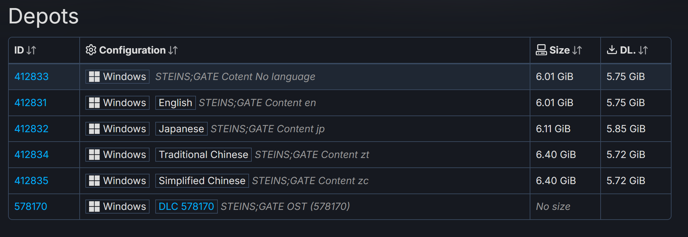</br><p align="center"><em>吐槽一下Steam版怎么还区分个No language和日文版</em></p>

Steam简中的游戏文件内容如下图，steam日文版的游戏文件也是差不多。</br>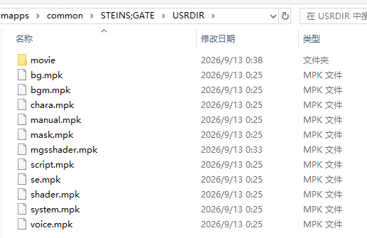</br>相比psv，PC平台的新引擎使用的是MPK格式的封包，这种封包的解包工具及项目已经有很多了，具体也可以在上面提及的[B站文章](https://www.bilibili.com/opus/782595981330874391)中找到，这里列出几个可供研究学习：

- [mpk-tools](https://github.com/spaceskynet/mpk-tools)
- [ChaosChildPCTools](https://github.com/Manicsteiner/ChaosChildPCTools)
- [mos9527-mages-tools](https://github.com/mos9527/mages-tools)
- [fengberd-MagesTools](https://github.com/fengberd/MagesTools)
- [sg-unpack](https://github.com/rdavisau/sg-unpack)

个人使用的是spaceskynet大佬的mpk-tools，虽然更方便的也可以用GARbro，但个人倾向于命令行操作、而且也不太确定GARbro内置的解包逻辑是否算最新最完善的所以就没选用。

psv版的游戏文件内容如下:</br>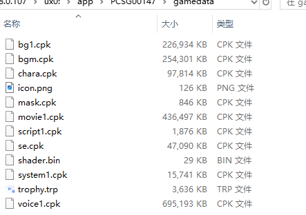</br>与PC Steam版不同的是，由于年代较早且开发链的不同，psv版的封包使用的是CRIWARE通用的CPK封包，这种封包格式过去也有很多大佬解析并制作过开箱即用的工具了，这里暂时使用的是</br>SpriteLisen大佬的[CriPakTools-GUI](https://github.com/SpriteLisen/CriPakTools-GUI) 和 另一个大佬的[YACpkTool](https://github.com/Brolijah/YACpkTool)。

CPK封包中的文件是有附带文件名信息封包和无文件名信息(Nameless)封包两种方式的，在对system1、script1、bg1、chara、movie1等封包尝试解包后，发现只有movie1封包是保留有文件名信息的。通过CriPakTools尝试CPK拆包、也能正常得到和MPK封包中文件数相差无几的一系列文件。但是使用CriPakTools试着封包并做rePatch运行后，发现游戏会直接卡在启动界面没法运行下去、甚至连崩溃都没有：</br></br>怀疑可能是封包中有数据没做对？打开hex编辑器对比一看，发现是CPK头部数据magic之后的4字节和TOC数据区块magic之后的4字节原先都是0x00000000、但重新生成的封包相同位置的4字节是0xFF000000：</br>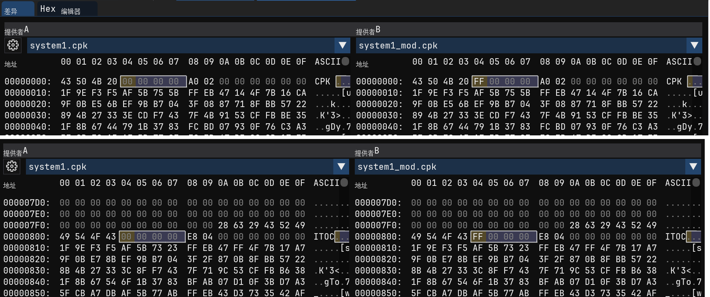</br>重新将这4字节修改为0x00000000即可让游戏正常读取运行，但比较麻烦的是后续在重新封包movie1.cpk发现还有ITOC、ETOC数据块开头magic后的4字节都要对应修改，老是这样用CriPakTools重新封包好又一处处寻找修改那4字节也挺麻烦的，本文在后续 [拓展：CPK资源封包的另一种方法](#拓展：cpk资源封包的另一种方法) 部分将会分析提出一种更方便准确的方法去实现官方CPK的封包解包。

## 2.字库和文本的分析

在wetor大佬发布的[石头门0汉化补丁博客](https://blog.wetor.org/posts/SG0CN/)的评论区处通过fl0w1nd大佬对switch石头门汉化的评论交流可以得知、石头门的图片格式字库通常在system包内，那就拆解psv的system1.cpk看看，发现其中98%是GXT magic的无文件名图像纹理文件，剩下id为59的文件应该是系统存档所需文件的小封包、id为62的文件对应steam版的system包内文件来看应该是`WAVTABLE.DAT`音频相关数据文件、故暂且不管它们。GXT图像文件的大致结构可查看[psdevwiki这里](https://www.psdevwiki.com/vita/index.php/GXT)，通常可以使用老牌工具[Scarlet](https://github.com/xdanieldzd/Scarlet)将大部分纹理格式的GXT转换为PNG，转换后得到以下图片素材：</br>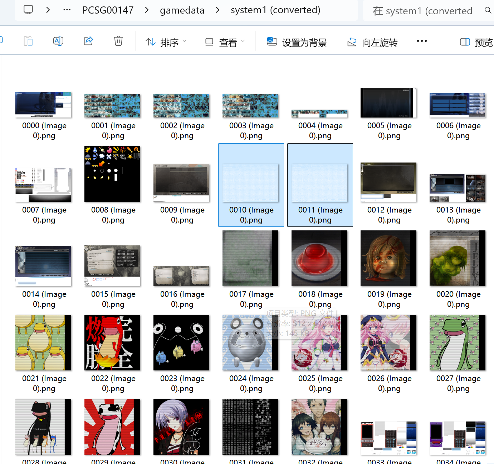</br>可以发现id为10和11的图片就是我们所需的图片字库：</br>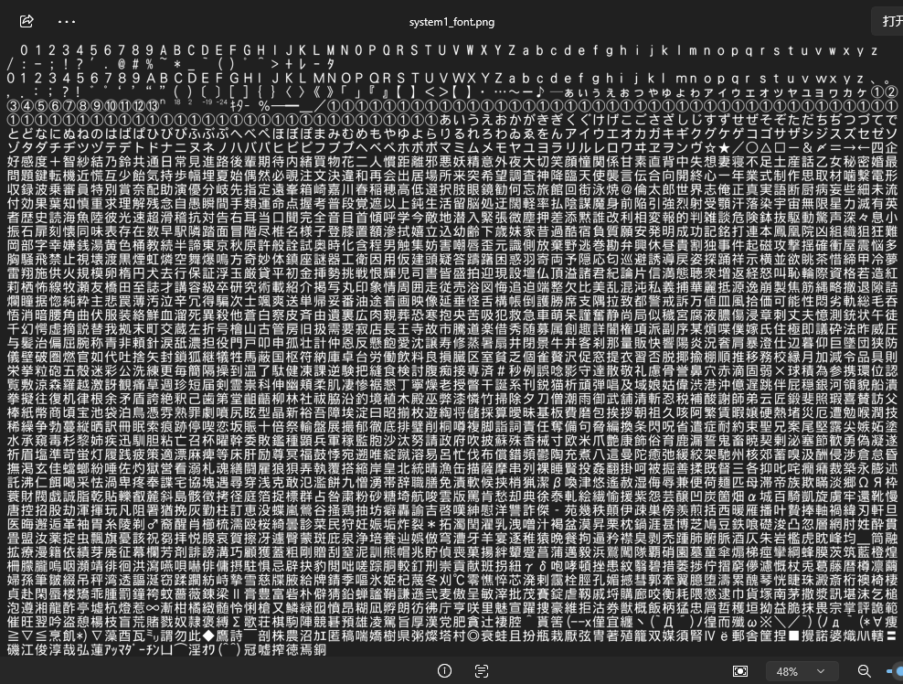

既然找到了字库，接着就要找到文本及文本与字符的映射关系了。通过fl0w1nd大佬的评论和Committee of Zero的[compendium文档](https://committeeofzero.gitbooks.io/mages-engine-compendium/content/scripting/strings.html)可得知、不同于通常文字游戏引擎会直接读取脚本中的明文并根据编码转换创建映射逻辑去字库取字，Mages的科学系引擎是直接将字符编码按顺序逐个编码为了0x8000开始的无符号2字节大端整数，而这些整数通常一一对应图片字库中从上到下从左到右的每一个字符、甚至包括空出来位置也是标识为一个字符，这也是以往PC上用于重建该引擎字库图片工具[mgsfontgen-dx](https://github.com/CommitteeOfZero/mgsfontgen-dx)的基本构建逻辑。从[mgsfontgen-dx](https://github.com/CommitteeOfZero/mgsfontgen-dx)工具的使用示例和源代码大致了解到，制作一个图片字库通常需要Charset.utf8和CompoundCharacters.tbl：</br>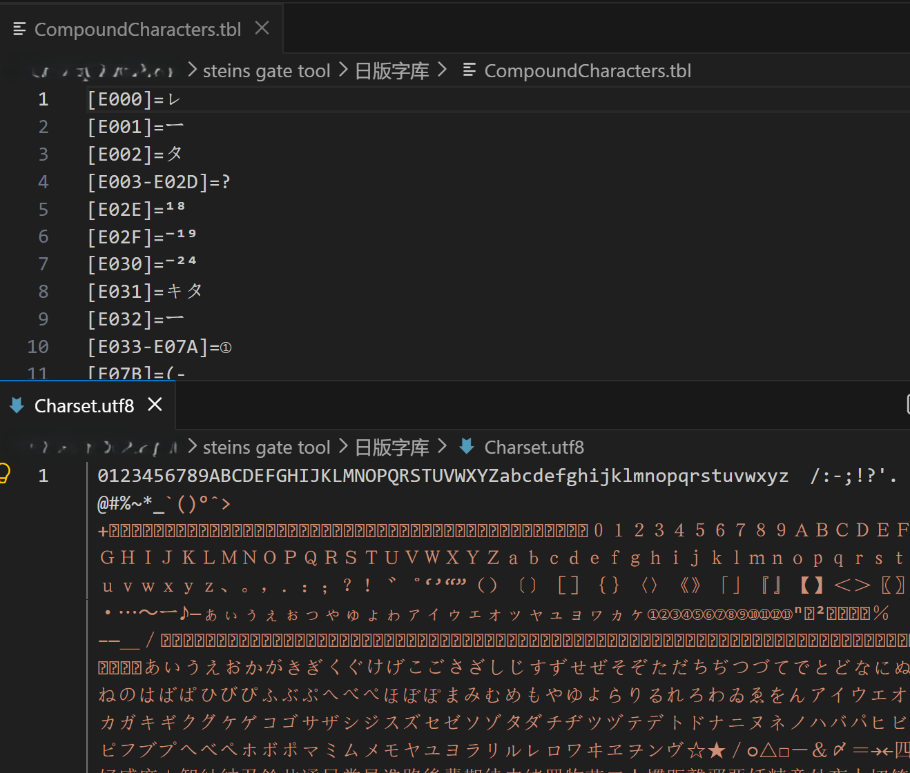</br>Charset.utf8其实是一个存储着所有图片字库中出现的字符的utf8编码文本，但图片字库中还存在着诸如：</br>
- 图片显示为空但仍占一个字符位的“空”字符
- 部分无法轻易用单字符表示出来的特殊复合组成字符，如`¹⁸`、`キタ`、`(ﾉ`等
- 少数可能是宽距字符（视觉上占两个字母）或只有全角没找到半角表示的日文字符

Committee of Zero便把这些特殊的字符按`2字节hex=特殊字符`映射方式记在了CompoundCharacters.tbl中，而巧妙的是用于映射的`2字节hex`都是选用自Unicode的PUA（Private Use Area）私有使用区U+E000 ~ U+F8FF中，这样不仅能将各种特殊字符直接表示为Charset.utf8中的单字符，还大大方便了mgsfontgen-dx工具程序在读取所需字符表Charset.utf8时可以将特殊字符读取为单个PUA字符、随后只要判断为Unicode-PUA则去CompoundCharacters.tbl查表并绘制特殊字符，是一种非常巧妙的应对字库特殊字符绘制的映射方式。

由于[mgsfontgen-dx](https://github.com/CommitteeOfZero/mgsfontgen-dx)和[SciAdv.Net](https://github.com/CommitteeOfZero/SciAdv.Net/tree/master/src/SciAdvNet.SC3/Data/SteinsGateHD)都可以找到Committee of Zero已经制作好的Steam版日文字库，而LingYu0721大佬也曾分享过[steam中文版的charset](https://github.com/LingYu0721/steinsgate_charset)，这里只需要准备psv日文版的Charset.utf8和CompoundCharacters.tbl，个人使用的是网易有道词典自带的OCR和[有道智云的通用文字识别](https://ai.youdao.com/new/product-ocr-print.s)，主流的翻译或扫描用软件对这些密集日文字库图片的识别准确率都还算可以。这里分享一下我校准过的[Steam日文、中文字库和psv日文字库](https://github.com/lzhhzl/sg_psv_localize/tree/main/fonts)文件。

在Steam日文版的system.mpk包内也能找到图片字库FONT.PNG，分辨率是3072*2208，先试着降分辨率到psv分辨率`2048*xxxx`再转成gxt文件扔回psv看看能不能直接用PC的字库，首先要确定字库gxt原先的Texture type和Texture Base Format：
```
0x30~0x33 00 00 00 60 Texture type 
0x34~0x37 00 70 00 00 Texture Base Format
```
根据[psdevwiki这里](https://www.psdevwiki.com/vita/index.php/GXT)可以推断出Texture type是LINEAR而非SWIZZLED的，而Texture Base Format 0x00007000这种既不是PVR、DXT相关也不是常见的ARGB/RGB反而比较少见，只好去看看Scarlet的[源码](https://github.com/xdanieldzd/Scarlet)。通常Scarlet都是通过[SceGxmTextureFormat](https://github.com/xdanieldzd/Scarlet/blob/master/Scarlet/Platform/Sony/PSVita.cs#L130)和[SceGxmTextureBaseFormat](https://github.com/xdanieldzd/Scarlet/blob/master/Scarlet/Platform/Sony/PSVita.cs#L14)两个枚举定义类通过位或运算及Texture type的情况综合推断出GXT容器内大多数纹理的Texture Base Format，按照这一逻辑最终定位了原始图片字库GXT的Texture Base Format应该是
```
public enum SceGxmTextureBaseFormat : uint
{
    U8 = 0x00000000,
    ......
};

public enum SceGxmTextureSwizzle1Mode : ushort
{
    ......
    R111 = 0x7000
};

U8_R111 = SceGxmTextureBaseFormat.U8 | SceGxmTextureSwizzle1Mode.R111
```
从常量名字面意思看就是只有一个8位红色通道值、其他GBA三个通道默认都处理为全255的单通道纹理数据，但这里有一个坑，当我用python Pillow查看Scarlet转换出来的图像字库PNG时，发现其实只有A通道是有纹理实际值、而RGB通道都是全255的，猜测可能是Scarlet直接将R111按照ARGB的纹理顺序保存为PNG，所以在生成psv可用的其他GXT字库前需要抽取的是RGBA PNG的A通道的值而不是R通道的值，好在Steam版的FONT.PNG也是同样的只有A通道有字形的实际值、且RGB通道都是全255。这里我的做法是先将降了分辨率的Steam日文字库FONT.PNG通过GIMP(Photoshop之类的工具也可以)保存为无压缩的A8格式DDS，之后通过psv官方SDK中的psp2gxt（可以在[这里](https://www.reddit.com/r/VitaPiracy/comments/c8m37s/release_psvita_sdk_3570_devnet_files/)找到）将这个A8 DDS先保存为LINEAR GXT：</br>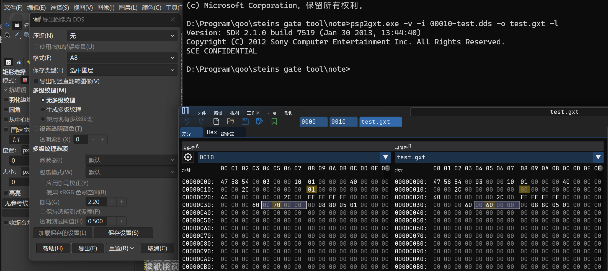</br>可以看到新生成的test.gxt对比原先的字库gxt的Texture Base Format差别只是0x34\~0x37为`00 60 00 00`(U8_R000)，但存储的纹理和原先的U8_R111都是相同的uint8 单通道字形纹理数据，故我们只需要将新生成的GXT的0x34\~0x37重新改为`00 70 00 00`、0x18也顺便改为0x01，即可制作出psv可用的U8_R111 GXT字库文件。通过repatch放回psv进行测试可以看到换上新日文字库的正常乱码效果：</br>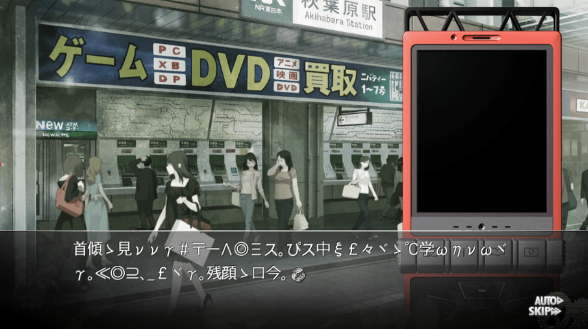

确定了Steam版的字库可以缩分辨率直接用到psv后，接着就到了文本。很明显psv的脚本文件都在script1.cpk中，拆开可以得到一堆文件头为SC3的无文件名文件，根据Committee of Zero的compendium文档对[SC3文件格式](https://committeeofzero.gitbooks.io/mages-engine-compendium/content/scripting/scx_file_format.html)的描述可以得知SC3文件结构大致如下：
```
char[4] SC3\0

uint32 String address table offset: 指向一个由脚本内所有`图片字库映射编码字符串`的偏移量组成的偏移量表

uint32 Return address table offset: 指向一个返回地址表的偏移量，该表由相对于每次调用的文件开始执行指令的地址（即偏移量）组成。

0xC开始 Label table: 直接到了一个包含指向指令或本地数据块的
地址表(n*uint32 label_offset)，用于存储指令或局部数据块的地址。这些地址
可用于跳转目标或数组等用途。第一个entry是脚本的入口点。
```
指向这些table的offset和Label table内的offset都是小端序。不过比较常见的是、Label table指向的最后一个label的末尾总是与String address table的开头重合，而String address table的末尾与Return address table的开头重合，Return address table的末尾(或开头)甚至与String address table指向的第一个字符串的开头重合，而Label table的末尾则与Label table指向的第一个label重合。

虽然SC3文件看似复杂，但对于汉化来说并不需要把整个SC3文件解析还原成原始脚本，我们重点要读取并改动的是String address table及其指向的各个strings，这里就要用到wetor大佬编写的[MagesTools](https://github.com/wetor/MagesTools)工具，非常感谢wetor大佬制作了一个这么方便的汉化工具。[MagesTools](https://github.com/wetor/MagesTools)支持用Charset.utf8或自制一个Charset_utf8.tbl作为字符码映射表去提取并转换出明文文本，我个人更喜欢制作一个Charset.tbl、因为可以把CompoundCharacters.tbl中的特殊字符合并到其中：</br>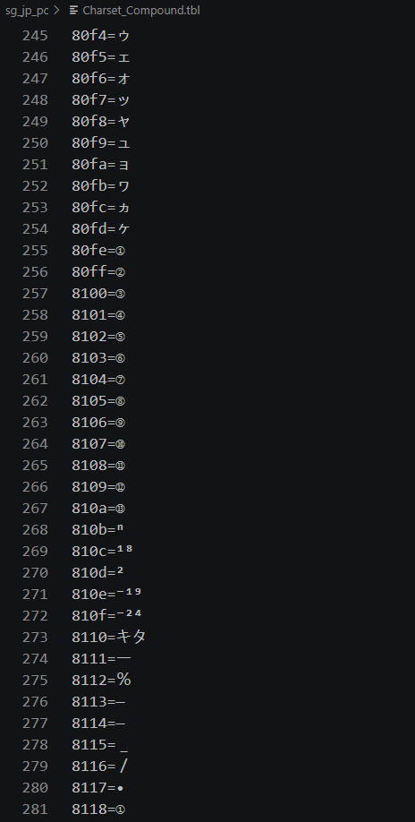</br>这样就能避免在对照Steam版日文和psv版日文内容时部分特殊字符内容只能够用Unicode-PUA这种难看懂的字符表示，而且虽然MagesTools最后也是根据单一字符映射回专有字符码，但我最后要移植的是Steam版中文、只要Steam版中文的Charset.tbl内不转换那些Unicode-PUA字符在CompoundCharacters中的实际对应特殊字符、依旧能正常兼容特殊字符转换出中文字库对应的字符码内容。这里我制作了一个[转换工具](https://github.com/lzhhzl/sg_psv_localize/blob/main/build_mages_tbl.py)可以根据任意Charset.utf8和CompoundCharacters.tbl制作出Charset.tbl，并且还可以根据设置好的所有CompoundCharacters特殊字符在Charset.utf8的位置来按顺序校准它们的Unicode-PUA字符编码。

本以为找到这工具就可以上手即用了，但事情远没我想象的那么简单(＠_＠;) ：</br>当我使用MagesTools v0.2.4(git commit  426cf9d) Releases尝试export psv日文版的SC3部分文件时，Magestool会直接报Warning
```
MagesTools_win.exe -debug=2 -skip=false -format=NpcsP -type=script -export -tbl="Charset_Compound.tbl" -source="ID00012" -output="ID00012.txt"
MagesTools
Version: 0.2.3_2024.06.05
Author: WéΤοr (wetorx@qq.com)
Github: https://github.com/wetor/MagesTools
License: GPL-3.0

Warning: 字库可能缺少 [B5 83] 对应的字符！
```
但是psv script1中id为0的SC3文件、对应Steam版的`_ATCH.SCX`文件却是能正常转换出文本，好奇对比了script1 id0脚本和`_ATCH.SCX`文件导出的文本内容后发现MagesTools在转换psv SC3文本内容时很明显把0x04开头的指令内容解析错了、疑似导致吞掉了后面跟着的字符：</br>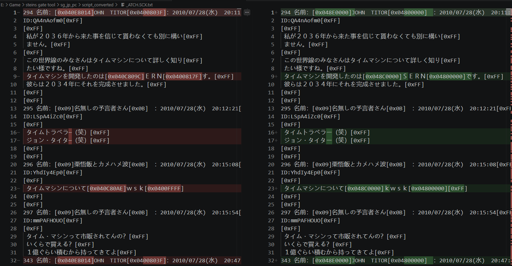</br>没办法只好翻Magestool的部分源码看看，了解到源码中 [NpcsFormat.go](https://github.com/wetor/MagesTools/blob/master/script/format/NpcsFormat.go#L50) 和 [NpcsPFormat.go](https://github.com/wetor/MagesTools/blob/master/script/format/NpcsPFormat.go#L55) 的DecodeLine函数对文本中SetColor(0x04)指令的处理在psv平台上的SC3出了问题：
```
NpcsFormat.go  #55:
case SetColor:
    text.WriteString("<#" + utils.BytesToHex(data[i+1:i+4]))
    i += 4

NpcsPFormat.go  #50:
case SetColor:
    text.WriteString(utils.FormatBytes(data[i : i+4]))
    i += 4
```
可以看到SetColor是默认了Color设置指令是4字节，就像`_ATCH.SCX`中的`[0x048E0000]`那样，但psv石头门的SC3貌似只用2字节就表示完了一个Color设置指令，就像`[0x040E8014]`其实只有`[0x040E]`才是指令和参数部分这样，找出了多个psv的SetColor 2字节指令值对照Steam版的SetColor 4字节指令值发现PC版的3位hex颜色值通常是从0x80为第一位开始、而psv只用了1位hex表示颜色值且基本上都是小于0x80，另外也发现了在import回去时TrimSpace会导致字符块左侧存在全角/半角空格会被消除的问题，我暂时对这些问题进行了修复并对原项目提交了[PR](https://github.com/wetor/MagesTools/pull/8)。最后这里给出我自己使用MagesTools进行export和import命令作为参考：
```
MagesTools_win.exe -debug=2 -skip=false -format=NpcsP -type=script -export -tbl="Charset_Compound.tbl" -source="script1_sample" -output="script1_converted"

MagesTools_win.exe -debug=2 -skip=false -format=NpcsP -type=script -import -tbl="Charset.tbl" -source="script1_sample\ID00000" -input="script1\ID00000.txt" -output="script1\ID00000"
```
用重新编译的MagesTools将简单修改过的序章剧情日文文本配合Steam日版字库的tbl import出新文件，放入script1封包通过repatch进行测试、可看到游戏正常显示出了修改后的文本</br>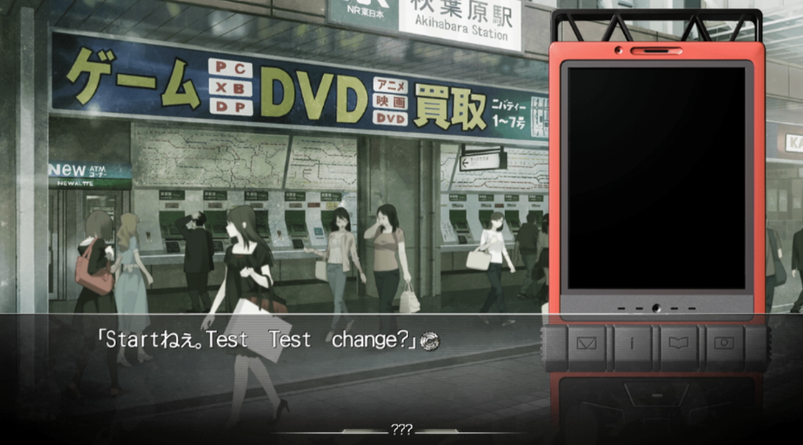

字库也跑通了，文本也能修改了，于是便换上降分辨率的Steam中文字库和替换了中文文本的序章SC3脚本文件放入封包进行repatch测试，没想到游戏又卡在了一开始的启动界面、进都进不去，明明前面封包和SC3文本的导入都测试成功了呀、试着换上了Steam日文制作的字库后又能进去了，而且psv上的这mages引擎程序运行出了读取素材等异常问题还偏偏不报错崩溃丢psp2dump、就一直在那里卡着，一时半会也搞不清这回是哪里出了问题、头大 /(ㄒoㄒ)/。

之后猜测游戏程序内的错误处理应该是打印了常规log而并非崩溃，通常实机要看log可能要用到远程调试器，但也可以用vita3k运行试试，虽然vita3k没法正常运行游玩psv石头门本篇，但是却刚好能走完整个初始化流程，运行了之前有问题的中文字库补丁终于发现了问题`texture buffer is too small(syatem(10)) vram 00300000 tex 00480000`所在：</br>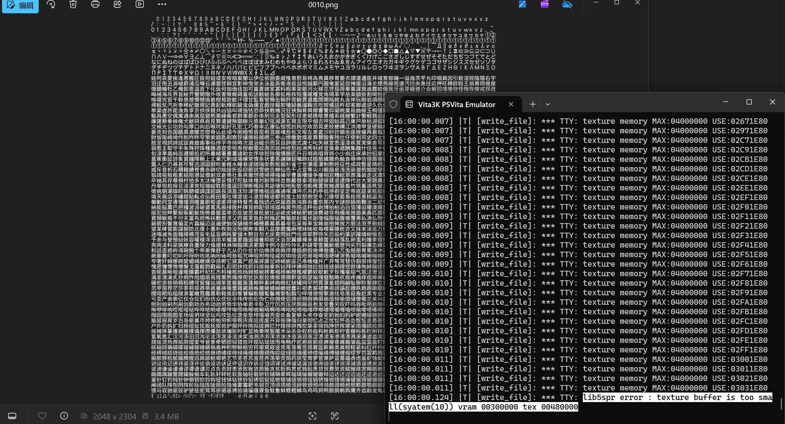</br>从报错内容可以大致推断出程序留给字库图像纹理的vram大小只有0x00300000，而我制作的中文字库纹理大小却达到了0x00480000，而原先分辨率为`3072*3456`的中文字库图像降了分辨率后也有着`2048*2304`，结合我之前提到本作字库图像GXT存储的字形纹理数据实际只有单通道的纹理数据，即刚好可计算得出`2048*2304*1=0x480000`，故反推出程序设定的vram只能载入`0x300000=2048*1536*1`分辨率大小的纹理，**"这得要砍掉不少字符，先生".jpg**。

此时看来只有两个选择，要么将Steam中文的字库自行缩减到刚好能用`2048*1536`分辨率的字库图装下，要么就只能逆向主程序eboot找到并修改对应vram的大小设置。如果要考虑前者缩减字库所用字符的方案，就意味着我要把中文字库用到的约4566个字符缩减到大约3072个字符及以下，这1500多个要删减的字符就算是把日文、特殊字符和部分符号全删可能也不够。还是决定花点时间逆向eboot找找相关逻辑试试。由于我本身并不擅长逆向、对arm的汇编语法和相关寄存器结构也没有完全掌握，我选用结合AI的帮助方案尝试辅助整个逆向理解过程，这里我用到的分析工具是Ghidra和插件[VitaLoaderRedux](https://github.com/CreepNT/VitaLoaderRedux)和AI agent可用的[GhidraMCP](https://github.com/LaurieWired/GhidraMCP)工具。另外还需要提取解密NNP版eboot并转化为elf，通常可以用[FAGDec](https://github.com/TeamFAPS/PSVita-RE-tools/tree/master/FAGDec)提取解密并直接转换为elf，具体操作方法之后我可能会写在另一篇博客里，这里暂不过多赘述。接下来用ghidra分析eboot elf的过程大致如下：

- 通过字符串搜索在虚地址0x810c3abc处找到“lib5spr error : texture buffer is too small(%s) vram %08X tex %08X”格式化字符串s_lib5spr_error_:_texture_buffer_i_810c3abc，被函数FUN_81044c7a:81044fba处调用，通过AI分析FUN_81044c7a大致是一个**GXT 纹理加载/更新函数**、通过FUN_8104510c:81045138调用：
    ```c
    void FUN_8104510c(undefined4 param_1,undefined4 param_2,undefined4 param_3,undefined4 param_4)
    {
        int iVar1;
        
        iVar1 = SceLibc_7747F6D7(param_2,&DAT_810c3aa0(GXT\0),4);
        if (iVar1 == 0) {
            FUN_81044c7a(param_1,param_2,param_3,param_4,0);
        }
        else {
            FUN_81044a78(param_1,param_2,param_3,param_4);  
        }
        return;
    }
    ```
    而FUN_81044c7a大致流程是：
    ```
    # 注意：以下为AI分析信息，不一定准确，仅供参考，欢迎指正
    1. 验证 GXT 魔数 → 如果不是 "GXT"，打印 "GXT format errror" 并返回
    2. 从 GXT 头部读取参数：
        - offset 0x30: Texture Type
        - offset 0x34: Texture Base Format
        - offset 0x38: 宽度（如 2048）
        - offset 0x3a: 高度（如 2304）
    3. 根据 Texture Base Format 确定 bpp iVar3和内部纹理格式号cVar13
        其他未知纹理 → 打印"This gxt format does not support"并默认为 0
    4. ★ LAB_81044f52 缓冲区大小检查 ★（处理GXT纹理vram部分的关键）
    5. 通过检查后，更新纹理结构体：
        - offset 0x38: bpp
        - offset 0x3a: stride
        - offset 0x1a: aligned_width
        - offset 0x1c: aligned_height
        - offset 0x3c: 内部格式号
        - offset 0x6c: Texture Base Format
        - offset 0x70: Texture Type
        - offset 0x12/0x14: 原始宽高
        - offset 0x20/0x24: 浮点宽高
        - offset 0x28/0x2c/0x30/0x34: 归一化系数 (1.0)
    6. 复制纹理名称到结构体 offset 0x03
    7. 处理调色板数据（仅格式 0x11/0x12）
    8. 将 GXT 纹理数据复制到 VRAM（调用 FUN_81044736 或 FUN_8104480e）
    9. 检查 aligned 尺寸是否 >= 原始尺寸，否则打印 "errrrrrrrrrrrrrrrrrror"
    ```
- FUN_81044c7a:LAB_81044f52部分的反汇编大致是：
    ```c
    LAB_81044f52:
    iVar4 = FUN_81043c82(param_1);  // 获取纹理结构体
    if (iVar4 == 0) return 0;

    if ((param_4 & 1) == 0) {
        // param_4 bit0 = 0：只检查宽高，不检查 VRAM 大小
        if ((*(ushort *)(iVar4 + 0x1a) < uVar5) || (*(ushort *)(iVar4 + 0x1c) < uVar7)) {
            FUN_8103e8c6("lib5spr error : texture buffer is too small(%s)\n", param_3);
        }
    } else {
        // ★ param_4 bit0 = 1：检查 VRAM 缓冲区大小（字库走此分支）★
        uVar10 = uVar5 + 0xf & 0xfffffff0;      // aligned_width = (2048+15)&~15 = 2048
        uVar8  = uVar7 + 3 & 0xfffffffc;        // aligned_height = (2304+3)&~3 = 2304
        iVar16 = 0;
        uVar11 = uVar10 * iVar3 >> 3;           // stride = 2048 × 8 / 8 = 2048

        if ((cVar13 == '\x11') || (cVar13 == '\x12')) {
            iVar16 = 0x400;                     // 特定纹理格式加调色板
        }
        // uVar6 = (2304 × 2048 + 63) & ~63 + 0 = 0x480000
        uVar6 = (uVar8 * uVar11 + 0x3f & 0xffffffc0) + iVar16;

        if (*(uint *)(iVar4 + 0x60) < uVar6) {
            // ★★★ 关键报错点 ★★★
            // 0x300000 < 0x480000 -> 触发报错
            FUN_8103e8c6("lib5spr error : texture buffer is too small(%s) vram %08X tex %08X\n",
                        param_3,                    // "syatem(10)"
                        *(uint *)(iVar4 + 0x60),    // vram = 0x300000
                        uVar6);                     // tex = 0x480000
            do {
                /* WARNING: Do nothing block with infinite loop */
            } while(true);                     // 死循环
        }
        // 通过检查后，更新结构体并复制数据...
    }
    ```
    显然这个由FUN_81043c82(param_1)获取结构体iVar4的offset 0x60就是我要找的vram大小设置来源。进入FUN_81043c82从反汇编观察到返回的结构体基址是0x814fb1e4(DAT_814fb1e4)，我要找的vram大小设置来源应该是DAT_814fb244，但FUN_81043c82不涉及对DAT_814fb1e4结构体的更改，让AI找一遍这个基址的XReferences，找到了以下调用链：
    ```
    FUN_81043cfc:81043db4 (Spr_AllocTexture)
        ↓ 计算 total_size = palette_size + aligned(data_size, 64)
        ↓ ★ 将 total_size 写入纹理结构体 offset 0x60 ★
           (&DAT_814fb244)[全局纹理索引 * 0x2e] = total_size（计算出的缓冲区大小 0x300000）

    ↑
    FUN_81043fbe:81044054 (Spr_CreateTexture)
        ↓ 计算 uVar2 data_size = aligned_height(如1536) × aligned_width(如2048)
        ↓ uVar5 palette_size = 0（内部格式 9 无调色板）

    ↑
    FUN_81013ac6:81013ada (纹理创建包装)
        ↓ 调用 FUN_81043fbe Spr_CreateTexture

    ↑
    FUN_8101417a:810141cc (格式映射包装函数)
        ↓ param_4=8 -> uVar1内部格式 9 -> 传入FUN_81013ac6

    ↑
    FUN_81034e4c (脚本字节码命令处理器，创建纹理)
        ↓ 从某个脚本中读取宽度=2048、高度=1536
        ↓ 通过默认分支或 '0x64' 分支，格式参数映射为内部格式 9 (由8bpp 无调色板的字库推断)
    ```
- FUN_81034e4c 粗略的反汇编大概是：
    ```
    void FUN_81034e4c(int param_1)
    {
        char cVar1;
        int iVar2;
        undefined4 local_20; (纹理 ID)
        undefined4 local_1c; (宽度)
        undefined4 local_18; (高度)
        undefined4 local_14; (额外参数，仅命令 0x0A 使用)
        undefined4 local_10; (格式参数，仅命令 0x64 使用)
        
        iVar2 = *(int *)(param_1 + 0x20);
        *(int *)(param_1 + 0x20) = iVar2 + 2;
        cVar1 = *(char *)(iVar2 + 2); (从字节码流读取第3个字节作为命令字符 cVar1)
        *(int *)(param_1 + 0x20) = iVar2 + 3; (将读取指针前进3字节)
        FUN_810059ee(param_1,&local_20);
        if (cVar1 == '\x0A') {
            FUN_810059ee(param_1,&local_14);
        }
        FUN_810059ee(param_1,&local_1c);
        FUN_810059ee(param_1,&local_18);
        if (cVar1 == '\x01') {
            （格式 0x20）
            FUN_8101417a(local_20,local_1c,local_18,0x20);
        }
        else if (cVar1 == '\x02') {
            （格式 0x11）
            FUN_81013ac6(local_20,local_1c,local_18,0x11,1);
        }
        else if (cVar1 == '\x03') {
            （格式 0x10）
            FUN_8101417a(local_20,local_1c,local_18,0x10);
        }
        else if (cVar1 == '\x0A') {
            （特殊渲染）
            FUN_81013a10(local_20,local_14,local_1c,local_18,0x500,0x2d0,0);
        }
        else if (cVar1 == '\x64') {
            FUN_810059ee(param_1,&local_10); （从脚本读取格式参数）
            FUN_8101417a(local_20,local_1c,local_18,local_10);
        }
        else {
            （默认格式8）
            FUN_8101417a(local_20,local_1c,local_18,8);
        }
        return;
    }
    ```
    详细的bpp map逻辑貌似是在FUN_81043fbe:81044026调用的FUN_81043f54中。

- 既然vram的大小是由某个脚本设置的宽高参数计算而出的、那我们接下来的目的就是找找看到底读取并解释哪个脚本时最先使用了FUN_81034e4c函数。而FUN_81034e4c较为特殊、它是由PTR_FUN_81034e4c+1_810e7074这个**函数指针表**间接调用的，所以我们要再向上追踪调用了PTR_FUN_81034e4c+1_810e7074的函数FUN_81037272:81037336。

    通过AI对函数FUN_81037272的反汇编伪代码分析得出它是一个脚本字节码解释器（dispatch loop）：
    ```
    void FUN_81037272(int param_1) {
        byte bVar1;
        byte bVar2;
        byte *pbVar3;
        int iVar4;
        undefined1 auStack_10 [4];

        iVar4 = 0;
        DAT_8155b050 = 0;  // 清除退出标志
        do {
            pbVar3 = *(byte **)(param_1 + 0x20); // 读取字节码指针
            bVar2 = *pbVar3;                     // 字节0: [flag:1bit][group:7bits]

            if (bVar2 == 0xfe) {
                // 特殊指令：读取参数并设置退出标志
                *(byte **)(param_1 + 0x20) = pbVar3 + 1;
                FUN_810059ee(param_1,auStack_10);
                iVar4 = DAT_8155b050;
            } else {
                bVar1 = pbVar3[1];    // 字节1: 表索引
                if ((bVar2 & 0x7f) < 2) {
                    if ((bVar2 & 0x7f) == 0) {
                        if ((bVar2 & 0x80) == 0)
                            // group=0, flag=0
                            (&PTR_LAB_810373a8_1_810e7540)[bVar1](param_1);
                            iVar4 = DAT_8155b050;
                        else
                            // group=0, flag=1
                            (&PTR_LAB_810373a8_1_810e76c8)[bVar1](param_1);
                            iVar4 = DAT_8155b050;
                    } else {
                        // ★ group=1, flag=0 → FUN_81034e4c 在此表 ★
                        if ((bVar2 & 0x80) == 0)
                            (&PTR_FUN_81034e4c_1_810e7074)[bVar1](param_1);
                            iVar4 = DAT_8155b050;
                        else
                            // group=1, flag=1
                            (&PTR_FUN_81034e4c_1_810e713c)[bVar1](param_1);
                            iVar4 = DAT_8155b050;
                    }
                } else if ((bVar2 & 0x7f) == 0x10) {
                    if ((bVar2 & 0x80) == 0)
                        // group=0x10, flag=0
                        (&PTR_FUN_8103968c_1_810e85d8)[bVar1](param_1);
                        iVar4 = DAT_8155b050;
                    else
                        // group=0x10, flag=1
                        (&PTR_FUN_8103968c_1_810e86e0)[bVar1](param_1);
                        iVar4 = DAT_8155b050;
                }
            }
        } while (iVar4 == 0);  // 退出标志为0则继续循环
    }
    ```
    既然`FUN_81037272`是脚本的字节码命令解释函数、那想必一定会有一个脚本读取及处理函数来调用FUN_81037272进行部分命令的解释，随后让AI一顿找、总算分析出了从游戏 主初始化函数 到 FUN_81037272 的大致流程：
    ```
    FUN_81032c40 (主初始化函数)
    │
    ├─ 初始化阶段：
    │  逐步执行到 打印 "SCRinit()\n"
    │  随后调用 FUN_8103720c(2, 0)  ← SCRinit
    │
    ├─ 返回主体并逐步执行到 打印 "*********** start script ************\n"
    │
    └─ 开始主循环 (do-while)：
        调用 FUN_8103d6f2 (脚本执行调度器)
        → 遍历活跃脚本上下文链表 (DAT_815614a0)
        → 对每个上下文调用 FUN_81037272(context)  ← 字节码解释器
            → 读取字节码字节0: 假设按位分为两部分[flag:1bit][group:7bits]
            → 读取字节码字节1: 表索引 (bVar1)
            → 根据 group 和 flag 选择函数指针表：
            · group=0, flag=0 → 表 0x810e7540
            · group=0, flag=1 → 表 0x810e76c8
            · group=1, flag=0 → 表 0x810e7074  ← FUN_81034e4c 在此表中
            · group=1, flag=1 → 表 0x810e713c
            · group=0x10, flag=0 → 表 0x810e85d8
            · group=0x10, flag=1 → 表 0x810e86e0
            → 表[索引](context)  ← 间接调用

            地址 0x810e7074 处存储的值 = 0x81034e4d (FUN_81034e4c+1, Thumb)
            → 间接调用 FUN_81034e4c(context)
            → 从 context->0x20 读取字节码
            → 解析命令字符、纹理ID、宽度(2048)、高度(1536)
            → 调用 FUN_8101417a → FUN_81013ac6 → FUN_81043fbe → FUN_81043cfc
            → 分配 VRAM 0x300000 并写入DAT_814fb1e4结构体offset 0x60
    ```
    查看FUN_8103720c（SCRinit）的汇编和反汇编：
    ```
        undefined  FUN_8103720c ()  XREF[1]:     FUN_81032c40:81032d26 (c)
            assume LRset = 0x0
            assume TMode = 0x1
            undefined         <UNASSIGNED>   <RETURN>

        8103720c 2d  e9  f0       push       {r4 ,r5 ,r6 ,r7 ,r8 ,lr }
                 41
        81037210 4a  f6  00       movw       r5 ,#0xaf00
                 75
        81037214 0c  1c           adds       r4 ,r1 ,#0x0
        81037216 c8  f2  55       movt       r5 ,#0x8155
                 15
        8103721a 06  1c           adds       r6 ,r0 ,#0x0
        8103721c a7  00           lsls       r7 ,r4 ,#0x2
        8103721e 7a  59           ldr        r2 ,[r7 ,r5 ]=> DAT_8155af00
        81037220 31  1c           adds       r1 ,r6 ,#0x0
        81037222 03  20           movs       r0 ,#0x3
        81037224 ce  f7  48       bl         FUN_810054b8
                 f9
        81037228 47  f2  00       movw       r0 ,#0x7500
                 50
        8103722c c8  f2  0e       movt       r0 ,#0x810e
                 10
        81037230 3e  50           str        r6 ,[r7 ,r0 ]=> DAT_810e7500
        81037232 47  f2  04       movw       r0 ,#0x7204
                 20
        81037236 c8  f2  0e       movt       r0 ,#0x810e
                 10
        8103723a 50  f8  26       ldr.w      r1 ,[ r0 => PTR_s__atch.scr_810e7204 ,r6 ,lsl # 0x2 ] = 810c1c94
                 10
        8103723e 42  f2  bc       movw       r0 ,#0x25bc
                 50
        81037242 c8  f2  0c       movt       r0 => s_Loaded_script_%s_810c25bc  ,#0x810c        = "Loaded script %s\n"
                 10
        81037246 07  f0  3e       bl         FUN_8103e8c6
                 fb
        8103724a 00  20           movs       r0 ,#0x0
        8103724c 06  f0  83       bl         FUN_8103d556
                 f9
        81037250 79  59           ldr        r1 ,[r7 ,r5 ]=> DAT_8155af00
        81037252 8a  7b           ldrb       r2 ,[r1 ,#0xe ]
        81037254 12  04           lsls       r2 ,r2 ,#0x10
        81037256 cb  7b           ldrb       r3 ,[r1 ,#0xf ]
        81037258 63  f3  1f       bfi        r2 ,r3 ,#0x18 ,#0x8
                 62
        8103725c 4b  7b           ldrb       r3 ,[r1 ,#0xd ]
        8103725e 63  f3  0f       bfi        r2 ,r3 ,#0x8 ,#0x8
                 22
        81037262 0b  7b           ldrb       r3 ,[r1 ,#0xc ]
        81037264 d2  18           adds       r2 ,r2 ,r3
        81037266 44  61           str        r4 ,[r0 ,#0x14 ]
        81037268 89  18           adds       r1 ,r1 ,r2
        8103726a 01  62           str        r1 ,[r0 ,#0x20 ]
        8103726c 01  20           movs       r0 ,#0x1
        8103726e bd  e8  f0       pop.w      {r4 ,r5 ,r6 ,r7 ,r8 ,pc }
                 81

    undefined4 FUN_8103720c(int param_1,int param_2)
    {
        byte bVar1;
        byte bVar2;
        byte bVar3;
        byte bVar4;
        int iVar5;
        int iVar6;
        
        // 从 CPK 包加载脚本文件到 RAM
        FUN_810054b8(3,param_1,(&DAT_8155af00)[param_2]);
        // 记录该上下文槽对应的脚本ID
        *(int *)(&DAT_810e7500 + param_2 * 4) = param_1;
        // 打印日志：通过脚本名称指针数组查找脚本名
        FUN_8103e8c6("Loaded script %s\n",(&PTR_s__atch.scr_810e7204)[param_1]);
        // 分配一个脚本执行上下文结构体（0x13C字节，清零）
        iVar5 = FUN_8103d556(0);
        // 获取已加载的脚本数据基址
        iVar6 = (&DAT_8155af00)[param_2];
        // 从脚本头部 offset 0xC~0xF 读取4字节小端序入口点偏移
        bVar1 = *(byte *)(iVar6 + 0xe);
        bVar2 = *(byte *)(iVar6 + 0xf);
        bVar3 = *(byte *)(iVar6 + 0xd);
        bVar4 = *(byte *)(iVar6 + 0xc);
        // 初始化执行上下文
        // offset 0x14 = 上下文槽号 (param_2)
        *(int *)(iVar5 + 0x14) = param_2;
        // offset 0x20 = 指令指针 = 脚本数据基址 + 入口点偏移（后续FUN_81037272从这个地址开始读取并解释字节码）
        *(uint *)(iVar5 + 0x20) =
            iVar6 + ((uint)bVar1 << 0x10 | (uint)bVar2 << 0x18 | (uint)bVar3 << 8) + (uint)bVar4;
        return 1;
    }
    ```
    其中能静态追溯的PTR_s__atch.scr_810e7204地址指向的数组表有很明显的多个脚本命名信息：
    ```
    PTR_s__atch.scr_810e7204
        XREF[2]:     FUN_8103720c:8103723a (*), FUN_810374b0:81037568 (*)   
        810e7204 94  1c  0c    addr    s__atch.scr_810c1c94     = "_atch.scr"
                 81
        810e7208 a0  1c  0c    addr    s__mail.scr_810c1ca0     = "_mail.scr"
                 81
        810e720c ac  1c  0c    addr    s__Startup.scr_810c1cac  = "_Startup.scr"
                 81
        810e7210 bc  1c  0c    addr    s__system.scr_810c1cbc   = "_system.scr"
                 81
        810e7214 c8  1c  0c    addr    s__tips.scr_810c1cc8     = "_tips.scr"
                 81
        810e7218 d4  1c  0c    addr    s_anime.scr_810c1cd4     = "anime.scr"
                 81
        810e721c e0  1c  0c    addr    s_CLRFLG.scr_810c1ce0    = "CLRFLG.scr"
                 81
        810e7220 ec  1c  0c    addr    s_macrosys.scr_810c1cec  = "macrosys.scr"
                 81
        810e7224 fc  1c  0c    addr    s_macrosys2.scr_810c1cfc = "macrosys2.scr"
                 81
        810e7228 0c  1d  0c    addr    s_MAIN00.scr_810c1d0c    = "MAIN00.scr"
                 81
        ......
        810e74f4 ac  25  0c    addr    s_zz.scr_810c25ac        = "zz.scr"
            81
        810e74f8 b4  25  0c    addr    s_ZZZ.scr_810c25b4       = "ZZZ.scr"
            81
    ```
    这些脚本名称字符串基本上是和Steam版的脚本名称对的上的，这下顺便就能把script1中所有无名脚本的名称给一一对应回去了。既然调用的FUN_8103720c(2, 0) -> FUN_8103e8c6("Loaded script %s\n",(&PTR_s__atch.scr_810e7204)[param_1=2])，那我们便可知SCRinit第一个载入的脚本是PTR_s__atch.scr_810e7204的第3个字符串信息（index 2）"_Startup.scr"。剩余的脚本大部分都是通过FUN_81037272分发了_Startup.scr中对其他脚本的调用指令进而异步执行起其他脚本。

一通分析下来，限制字库vram大小的最终的目标终于定在了_Startup.scr、即script1.mpk中index为2的脚本文件内容里，可是如果直接去MagesTools导出的文本中是找不到任何和2048或1536相关参数和指令了、显然MagesTools只能把演出文本部分中含有演出指令的文本一并导出、无法将脚本中其他指令的字节码进行读取和反编译导出。

回顾前面对SC3脚本数据格式的定义，可以得知Label table各个entry指向的offset则是存储脚本指令块和局部数据块的地址，第一个条目entry则是脚本的入口点，以ID3的脚本数据为例：</br>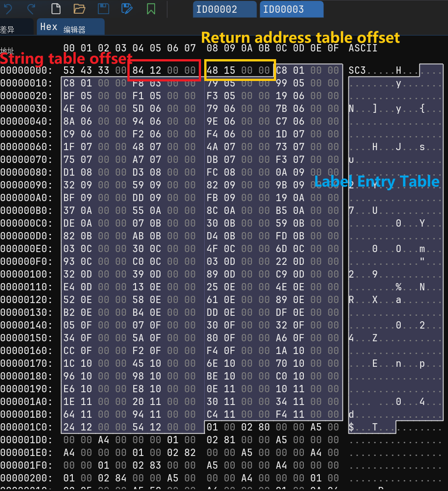

为了分析label table指向的各个instructions指令块，这里分别找到了CommitteeOfZero github中的 [sc3ntist](https://github.com/CommitteeOfZero/sc3ntist) 和 [MgsScriptTools](https://github.com/CommitteeOfZero/MgsScriptTools) 工具，它们都具备有decompile几个特定科学系作品（C;C / R;NE / S;GHD）SC3的功能，但即使用各自最新的commit并通过“steins_gate_hd”这个mode flag来尝试反汇编psv的SC3脚本，都是没法完全正常解析里面的指令的。由于我也没有研究懂Mages VM的opcode，我这里就不解释反编译原理和opcode结构了，为了方便理解和修改编译，我选用了 MgsScriptTools 让AI针对decompile内容中的erorrs进行了一部分的opcode补充和修改，制作出了一个临时针对psv S;G部分指令可解释的[MgsScriptTools 实验性修改](https://github.com/lzhhzl/MgsScriptTools)源码，仅作为decompile的参考。

通过命令`MagesScriptTool.exe --mode Decompile --compiled-directory cp --uncompiled-directory dcp --bank-directory mgs-spec-bank --flag-set steins_gate_hd --charset steins_gate_hd` 用修改过的MagesScriptTool获得了ID2 脚本的大致opcode内容：</br>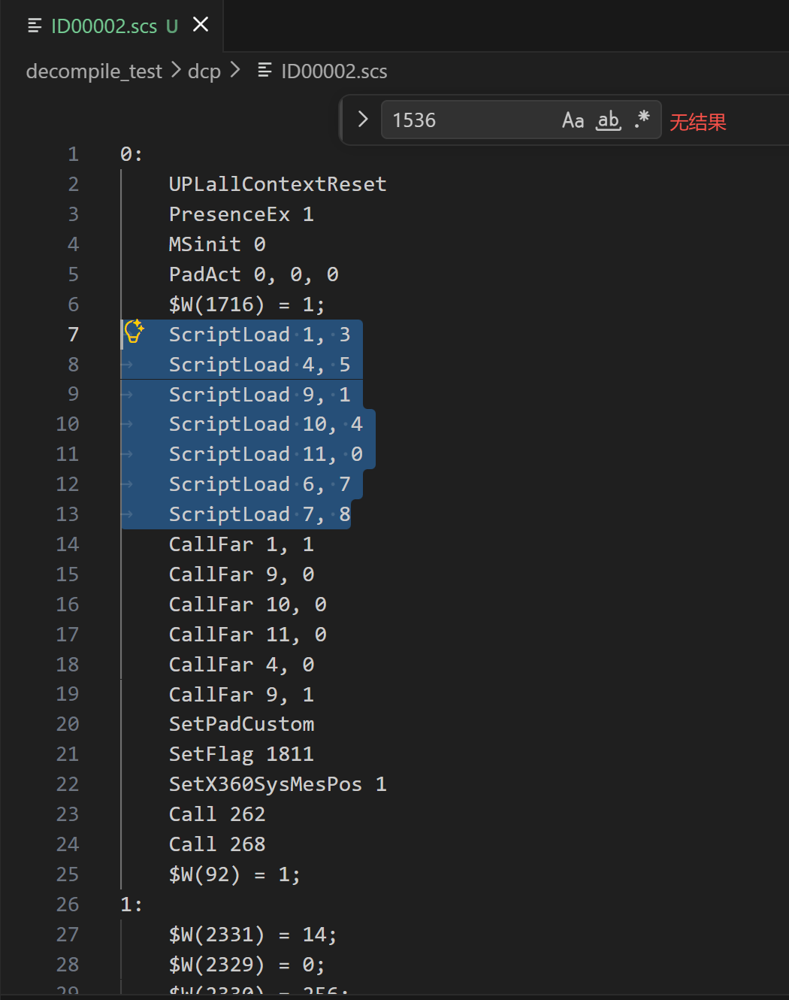</br>正常来说只要直接搜索计算出字库vram限制的宽度2048和高度1536就可以找到相关设置指令了，结果并没有搜索到？！但看到第0段指令的解释中出现了一些名为ScriptLoad，怀疑这是用于加载其他脚本的指令。在[sc3ntist/src/parser/CommonDisassembler.inl](https://github.com/CommitteeOfZero/sc3ntist/blob/master/src/parser/CommonDisassembler.inl)中找到如下定义
```
src/parser/CommonDisassembler.inl #L28
I2(ScriptLoad, EXPRESSION, "scriptBuffer", EXPRESSION, "scriptFile")
```
可以确定第一个参数是script BufferID而第二个参数是script FileID。回看CommitteeOfZero Compendium笔记中的[virtual_machine](https://committeeofzero.gitbooks.io/mages-engine-compendium/content/scripting/virtual_machine.html)章节提到:
```
Not the entire script body is loaded at once. Instead, currently required scripts are loaded into script buffers. The runtime will start by loading the startup script (e.g. _Startup_win.scx); any further required scripts are loaded with the LoadScript instruction at runtime.

并非整个脚本体一次性加载。目前，所需脚本会被加载到脚本缓冲区中。运行时首先会加载启动脚本（例如 _Startup_win.scx）后续所需的脚本则在运行时通过 LoadScript 指令加载。
```
再结合ID2脚本的第一个出现的ScriptLoad指令`ScriptLoad 1, 3`来看，此时该指令应该载入ID3脚本来进行加载，继续decompile script ID3并在opcode内容中搜索字库vram的两个宽高值，终于找到了其中的两个`CreateAlphaSurface 78, 2048, 1536`和`CreateAlphaSurface 79, 2048, 1536`</br>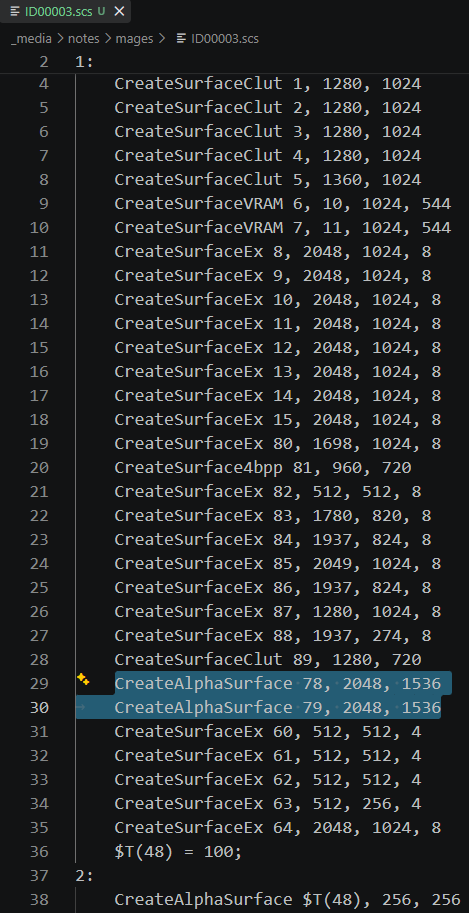</br>能大概看出来第一个参数应该是Surface ID，后两个就是预设的宽高值，其opcode格式是
```
- pattern: 01 00 00
  name: CreateAlphaSurface
  operands: [expr, expr, expr]
  flags: [new_createsurface]
```
和Steam PC版使用的是同一个opcode。根据Compendium笔记中的[Expression encoding](https://committeeofzero.gitbooks.io/mages-engine-compendium/content/scripting/expressions.html)的内容可知`Expressions (and all included terms) evaluate to 32-bit signed integers.`以及`Reminder: Even immediate values end with a precedence byte.`，即CreateAlphaSurface的3个参数的表达式各用了4 bytes的小端值，加上这3个参数又是纯数字、估计就是立即值表示。观察[Expression encoding](https://committeeofzero.gitbooks.io/mages-engine-compendium/content/scripting/expressions.html)章节中的立即值计算伪C代码:
```c
uint8_t *token;
int32_t result;

switch (token[0] & 0x60) {
  case 0:  // Token length: 2 bytes
    result = (token[0] & 0x1F);
    if (token[0] & 0x10)  // negative
      result |= 0xFFFFFFE0;
    break;
  case 0x20:  // Token length: 3 bytes
    result = ((token[0] & 0x1F) << 8) + token[1];
    if (token[0] & 0x10)  // negative
      result |= 0xFFFFE000;
    break;
  case 0x40:  // Token length: 4 bytes
    result = ((token[0] & 0x1F) << 16) + (token[2] << 8) + token[1];
    if (token[0] & 0x10)  // negative
      result |= 0xFFE00000;
    break;
  case 0x60:  // Token length: 6(!) bytes
    // token[1]..token[4] is a little-endian signed int32
    result = READ_LITTLE_ENDIAN_INT32(token + 1);
    break;
}
```
能大概总结出可能的四种数据长度：
| `token[0] & 0x60` 的值 | Token 总长度 | 编码方式 |
|------------------------|-------------|----------|
| `0x00` | 2 字节 | 5 位有符号值 |
| `0x20` | 3 字节 | 13 位有符号值 |
| `0x40` | 4 字节 | 21 位有符号值 |
| `0x60` | 6 字节 | 完整 32 位有符号值 |
好在MgsScriptTools的[ExpressionTokenListEncoding.cs](https://github.com/lzhhzl/MgsScriptTools/blob/9a8f0d2fa1f4844db091bc6524c4bcd2745cd666/src/MagesScriptTool/ExpressionTokenListEncoding.cs#L57-L74)已经有根据这4种立即数长度计算出expr数据的计算逻辑：
```cs
void EncodeVarInt(int value) {
    if (value < -0x100000 || value >= 0x100000) {
        PutByte(0xE0);
        PutByte((byte)((value >> 0) & 0xFF));
        PutByte((byte)((value >> 8) & 0xFF));
        PutByte((byte)((value >> 16) & 0xFF));
        PutByte((byte)((value >> 24) & 0xFF));
    } else if (value < -0x1000 || value >= 0x1000) {
        PutByte((byte)(0xC0 | ((value >> 16) & 0x1F)));
        PutByte((byte)((value >> 0) & 0xFF));
        PutByte((byte)((value >> 8) & 0xFF));
    } else if (value < -0x10 || value >= 0x10) {
        PutByte((byte)(0xA0 | ((value >> 8) & 0x1F)));
        PutByte((byte)((value >> 0) & 0xFF));
    } else {
        PutByte((byte)(0x80 | ((value >> 0) & 0x1F)));
    }
}
```
由此可以反推出`CreateAlphaSurface 78, 2048, 1536`对应的opcode数据大概是：
```
01 00 00       ← opcode (3 bytes): CreateAlphaSurface
A0 4E 00 00    ← expr(78):   A0=3字节模式|值高位0, 4E=值低位78, 00=priority, 00=结束
A8 00 00 00    ← expr(2048): A8=3字节模式|值高位8, 00=值低位0, 00=priority, 00=结束
A6 00 00 00    ← expr(1536): A6=3字节模式|值高位6, 00=值低位0, 00=priority, 00=结束

# 注意：每个立即值Token最后多出来的 00 byte都是默认的precedence byte。
```
同理`CreateAlphaSurface 79, 2048, 1536`，故我们只需要回到ID3的脚本中找到相应的opcode指令并增大`A6 00 00 00`就可以了，这里我将1536增大成了2304（A9 00 00 00）：</br>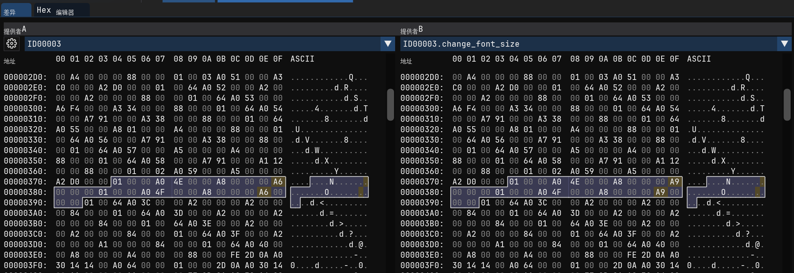</br>最终将修改好的字库分辨率字节码的script1-id3脚本和注入了中文的序章脚本重新封包并repatch测试，终于看到了使用steam中文字库的正常显示：</br>

另外虽然[sc3ntist](https://github.com/CommitteeOfZero/sc3ntist)导出的decompile结果应该会更直观且详尽、但是项目较老且用C编写、我就没有花时间让AI去学习并尝试支持psv了，但wetor大佬的MagesTools是参考过sc3ntist进行编写的，感兴趣的大佬可以去看看能不能做成一个Mages SC3的通用Decompiler工具。

## 3.UI图像和CG图像的分析

解决完了字库和文本，接下来就来处理system1里面其他的UI图像GXT，打开查看任意一个system1中图像GXT的数据可看到：
```
0x30~0x33 00 00 00 60 Texture type 
0x34~0x37 00 10 00 95 Texture Base Format
```
Texture Base Format为0x95001000很明显也不是PVR或DXT压缩纹理，继续去Scarlet的[PSVita.cs源码](https://github.com/xdanieldzd/Scarlet/blob/master/Scarlet/Platform/Sony/PSVita.cs)找找看，比对发现应该是：
```
public enum SceGxmTextureBaseFormat : uint
{
    ......
    P8 = 0x95000000,
    ......
};

public enum SceGxmTextureSwizzle4Mode : ushort
{
    ......
    ARGB = 0x1000,
    ......
};

P8_ARGB = SceGxmTextureBaseFormat.P8 | SceGxmTextureSwizzle4Mode.ARGB,
```
从常量名字面意思上看很明显是8位Palette(调色板)的量化ARGB图像，用python Pillow打开Scarlet对应转换出的PNG也可以确认是P mode图像，这里我采用的方法是先将Scarlet转换出的PNG用Pillow从Palette模式转为RGBA（256色调色板argb颜色值重新映射到每个像素）作为素材图，编辑好素材图后用python imagequant将RGBA素材图转为8位Palette图后再转为“带有透明度”的TGA图像，需要注意的一个坑是，如果你是用GIMP之类的图像软件将RGBA或带透明度的Palette PNG图转为TGA图像，默认都会丢掉透明度A通道的值、只保留了RGB调色板，建议参照[TGA图像格式](http://www.paulbourke.net/dataformats/tga/)自己编写转换出“带有透明度”的Palette TGA图像，我自己也编写了一个将RGBA PNG量化到8位Palette并保存为“带有透明度”的Palette TGA的[python脚本](https://github.com/lzhhzl/sg_psv_localize/blob/main/quant_to_p8_tga.py)工具以供参考。最后通过psp2gxt将tga转换为LINEAR GXT即可丢回system1封包使用。
```
psp2gxt.exe -v -i test.tga -o test.gxt -l
```

接着是在bg1.cpk中的CG图像，打开查看bg1中任意一个无原始文件名文件的数据、发现并不是常规可直接辨识的纹理数据：</br>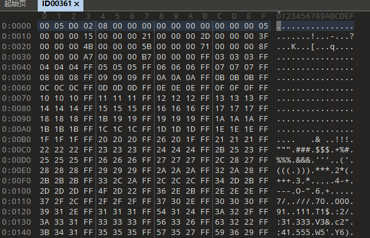</br>想起**暮光暗愈者**大佬的[MAGES引擎游戏资源提取方法指北](https://www.bilibili.com/opus/782595981330874391)提到过PSV上的MAGES引擎早期版的图像大部分都可以用[ChaosChildPCTools](https://github.com/Manicsteiner/ChaosChildPCTools)进行处理，经过一番尝试之后发现其中[RNEIC.py](https://github.com/Manicsteiner/ChaosChildPCTools/blob/master/RNEIC.py)的相关项目[RNE_image_converter](https://github.com/Manicsteiner/RNE_image_converter)的脚本处理逻辑和纹理数据是对的上的，通过[RNE_image_converter_windows_convert_all.py](https://github.com/Manicsteiner/RNE_image_converter/blob/main/RNE_image_converter_windows_convert_all.py)的代码大致了解到这是Mages自制的简单未压缩纹理文件结构：
```
uint16 width
uint16 height
uint16 pixelFormat
uint16 unKnow

when pixelFormat=8:
    256*4 bytes BGRA Palette Data
    width*height Palette Index Pixel Data

when pixelFormat=32:
    width*height*4 ARGB Pixel Data
```
显然纹理既没压缩也没swizzle，简单调整了该脚本的导出流程后，很快就将bg2中的图像全部转换出了PNG:</br>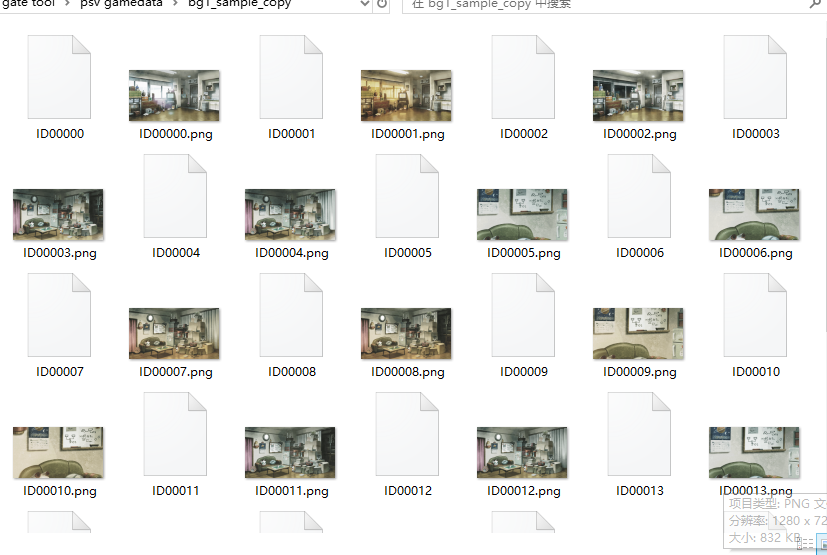</br>

为了探究RNE_image_converter的泛用支持性我还在psv的Steins;Gate 比翼恋理のだーりん（PCSG00146）和STEINS;GATE 線形拘束のフェノグラム（PCSG00250）两部作品的游戏数据中进行了测试，没想到发现 線形拘束のフェノグラム system中的ID14和ID15字库文件反而不是GXT格式而是这种Mages自己的简单纹理格式：</br>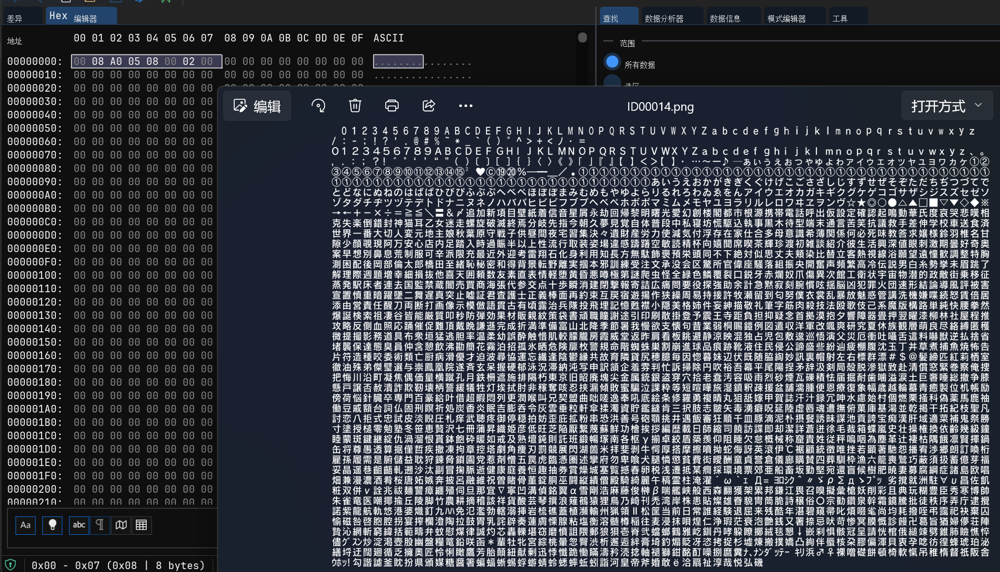</br>不过其纹理数据的存储方式比较特别，0x4-0x5的pixelFormat是8但0x6-0x7的unKnow-flag是2，且字库图像的本质上还是和石头门本篇用的图像格式一样是一个RGB三通道为全255、A通道为实际字形像素值的`[255,255,255,Alpha]`颜色格式。而 線形拘束のフェノグラム 字库图实际只存储了width*height大小的Alpha通道值，即：
```python
pixelFormat = 8
unKnow = 2
if pixelFormat == 8 and unKnow==2:
    pixelColor = {}
    for y in range(height):
        for x in range(width):
            color = fl.read(1)
            img.putpixel((x, y), (255, 255, 255, color[0]))
```
我顺便也把这个字库纹理的转换逻辑加到我自己的[RNE_image_converter_windows_mod.py](https://github.com/lzhhzl/sg_psv_localize/blob/main/RNE_image_converter_windows_mod.py)脚本中，作为参考。

## 4.Trophy界面奖杯文字乱码

原以为把script1里的剧情脚本全都移植一遍就完工了，打开游戏上实机一看、咋Trophy里的文字又乱了呢：</br>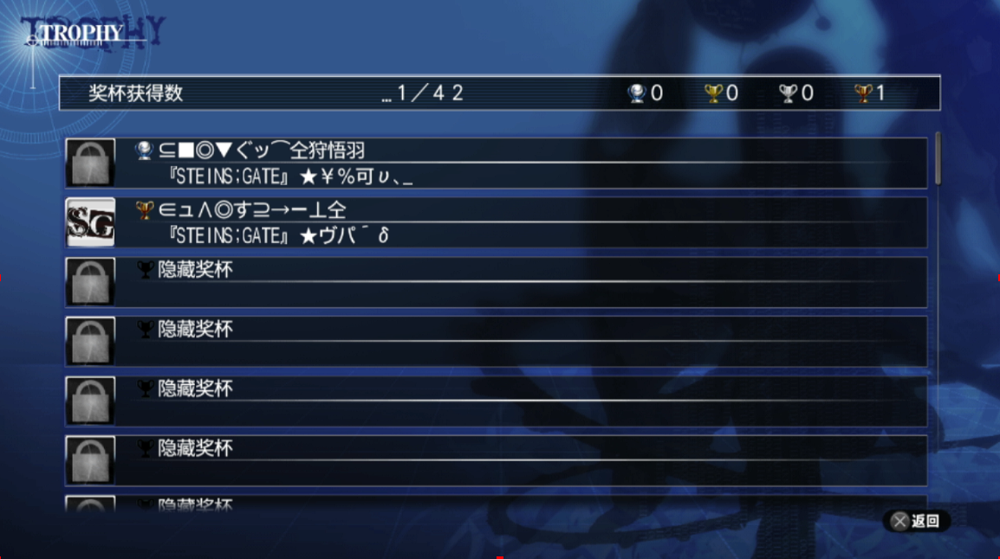</br>第一反应想着可能是script1里有对应简中版同样是日文的脚本所以跳过没翻译了，结果找遍了script1里的所有文本都没有找到Trophy中的任意一个奖杯描述，难不成是那种在eboot里的？于是扔eboot的elf进hex编辑器里搜搜，可即使将奖杯描述转成对应图片字库映射的文字码、不管大端还是小端搜索都一无所获，这下又头大了啊 /(ㄒoㄒ)/

这时突然想起之前，之前只顾着搞cpk封包里的内容，原来还剩下了一个trophy.trp文件没细细捣鼓过。扔进去hex编辑器里一看：</br>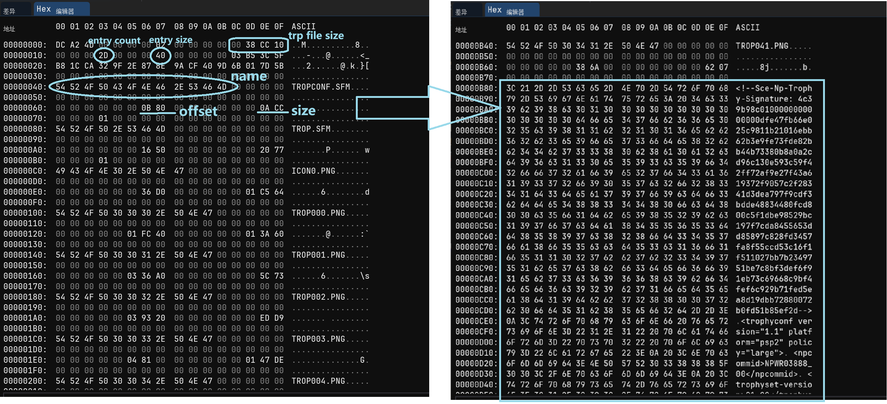</br>结构还挺简单的，大致是一个封包，大部分数据都是大端序：</br>
```
0xc-0xF trp文件的总size
0x10-0x13 trp内文件描述块(entry)的数量（等同于封存文件数）
0x14-0x17 可能是entry的offset，也可能是单个文件描述块size(0x40=64 bytes)

接着从0x40开始记述着各个entry data:
0x20 bytes ASCII编码文件名
0x4 bytes 0x00 pad
0x4 bytes 文件的绝对offset(uint32)
0x4 bytes 0x00 pad
0x4 bytes 文件的size(uint32)
剩下的0x10 bytes不知道有什么用

后续每个文件数据块都会pad到n*16
```
按照这个思路依次依次拆解里面的文件，可得知除了开头的TROPCONF.SFM和TROP.SFM文件，其他的都是png，估计奖杯描述多少就在这两个文件中了，从hex编辑器看TROPCONF.SFM貌似是纯文本，随便找个文本编辑器打开一看：</br>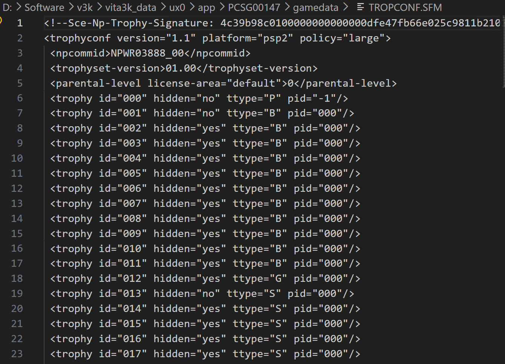</br>其实就是类似xml格式的一系列设置项，没我们想要的文本，接着打开TROP.SFM看看：</br>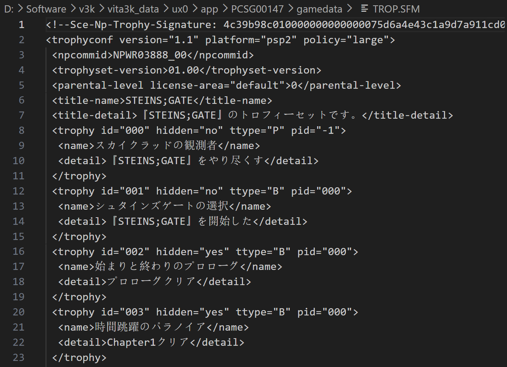</br>好家伙，总算找到了，原来是藏在这种地方。可是这样一来新的问题也随之而来：既然游戏内的文本在SC3中是通过从0x8000码位开始对应图片字库的字形进行一一映射存储的，根本就没有常规编码和转换的过程，而TROP.SFM中的奖杯描述文本是以utf8编码存储的明文文本，很明显不符合游戏剧情文本的显示逻辑，那Trophy这的奖杯描述又是咋显示出来的。

盲猜游戏程序中应该是有着“utf8文本到专有字库编码”的映射计算的，没办法只能继续上ghidra配合AI一起再分析挖掘eboot：

- ghidra通过ascii字符串搜索trophy.trp或TROP.SFM信息，发现从FUN_8104c4a6里开始涉及到从trophy.trp读取TROPCONF.SFM和TROP.SFM(s_TROP.SFM_810c4224)的过程，首先解析TROPCONF.SFM获取奖杯元数据，之后走了一个FUN_8104c144进行处理，AI分析FUN_8104c144只是一个trp内子文件entry数据的检索功能，加载出对应的子文件数据后跟着用FUN_8104c242进一步处理。

- FUN_8104c242进行xml解析TROP.SFM查找\<name>和\<detail>并调用FUN_8104c1d4来提取XML标签内容文本，并分别存储在DAT_814ab310（name）和DAT_814ab390（detail）

- DAT_814ab310和DAT_814ab390被FUN_8102b1e2引用，FUN_8102b1e2调用FUN_810a99c6来复制奖杯名称和详细信息数据，而FUN_810a99c6中用FUN_810a96cc引用`sceCesUtfxxStrToMbcsStr`(810d1a80)和`sceCesMbcsStrToUtfxxStr`(810d1a58)转换字符串。

- 对于FUN_810a96cc，AI分析：
    ```
    param_1: target encoding
    param_2: source encoding
    param_3: output buffer
    param_4: input string
    param_5: output buffer size

    The encoding constants seem to be:
    0x10 = UTF-16
    0x20 = UTF-32 (or some other)
    8 = UTF-8
    0x100 = some MBCS with locale

    So, param_1 < 0x100 and param_2 < 0x100: Uses sceCesUcsStrConvertEncoding - for Unicode-to-Unicode conversions (like UTF-8 to UTF-16)：
    param_1 < 0x100 and param_2 >= 0x100: Converts MBCS to UTF-xx (UTF-8 or UTF-16)
    param_1 >= 0x100 and param_2 >= 0x100: Converts via UTF-16 intermediate (MBCS to UTF-16 to MBCS)
    param_1 >= 0x100 and param_2 < 0x100: Converts UTF-xx to MBCS
    ```
    而FUN_810a99c6调用FUN_810a96cc(0x10, 8, dst, src, size)，即奖杯name/detail文本从UTF-8转换为UTF-16再存储在奖杯数据结构DAT_8149e328中

- 之后，追溯到在FUN_8101cf5a调用FUN_81032898处理DAT_8149e328中的数据后用FUN_81031642绘制字符，那关键的映射逻辑估计就在FUN_81032898里：
    ```asm
    undefined  FUN_81032898 ()
            XREF[3]:    FUN_8101cf5a:8101d5a6 (c) ,
                        FUN_8101cf5a:8101d62e (c) ,
                        FUN_8101cf5a:8101d682 (c)   
    81032898 2d  e9  f0       push       {r4 ,r5 ,r6 ,r7 ,r8 ,lr }
                41
    8103289c 41  f6  04       movw       r2 ,#0x1804
                02
    810328a0 c8  f2  0c       movt       r2 ,#0x810c
                12
    810328a4 14  88           ldrh       r4 ,[r2 ,#0x0 ]=>DAT_810c1804
    810328a6 07  1c           adds       r7 ,r0 ,#0x0
    810328a8 20  46           mov        r0 ,r4
    810328aa b7  f8  00       ldrh.w     r12 ,[r7 ,#0x0 ]
                c0
    810328ae 0e  1c           adds       r6 ,r1 ,#0x0
    810328b0 84  45           cmp        r12 ,r0
    810328b2 3b  d0           beq        LAB_8103292c
        LAB_810328b4   XREF[1]:     8103292a (j)   
    810328b4 44  f2  00       movw       r1 ,#0x4000
                01
    810328b8 c8  f2  0e       movt       r1 ,#0x810e
                11
    810328bc 0a  88           ldrh       r2 ,[r1 ,#0x0 ]=>DAT_810e4000 = 005Fh
    810328be 00  23           movs       r3 ,#0x0
    810328c0 b8  46           mov        r8 ,r7
    810328c2 a2  42           cmp        r2 ,r4
    810328c4 1d  46           mov        r5 ,r3
    810328c6 08  d0           beq        LAB_810328da
    810328c8 08  1c           adds       r0 ,r1 ,#0x0
        LAB_810328ca    XREF[1]:     810328d8 (j)   
    810328ca 94  45           cmp        r12 ,r2
    810328cc 01  46           mov        r1 ,r0
    810328ce 04  d0           beq        LAB_810328da
    810328d0 4a  88           ldrh       r2 ,[r1 ,#0x2 ]=>DAT_810e4002 = 0030h
    810328d2 02  30           adds       r0 ,#0x2
    810328d4 01  33           adds       r3 ,#0x1
    810328d6 a2  42           cmp        r2 ,r4
    810328d8 f7  d1           bne        LAB_810328ca
        LAB_810328da    XREF[2]:     810328c6 (j) ,  810328ce (j)   
    810328da 94  45           cmp        r12 ,r2
    810328dc 02  d1           bne        LAB_810328e4
    810328de 13  f5  00       adds.w     r0 ,r3 ,#0x8000
                40
    810328e2 19  e0           b          LAB_81032918
        LAB_810328e4    XREF[1]:     810328dc (j)   
    810328e4 44  f2  b2       movw       r1 ,#0x40b2
                01
    810328e8 c8  f2  0e       movt       r1 ,#0x810e
                11
    810328ec 0a  88           ldrh       r2 ,[r1 ,#0x0 ]=>DAT_810e40b2 = 3000h
    810328ee 2b  1c           adds       r3 ,r5 ,#0x0
    810328f0 a2  42           cmp        r2 ,r4
    810328f2 08  d0           beq        LAB_81032906
    810328f4 08  1c           adds       r0 ,r1 ,#0x0
        LAB_810328f6    XREF[1]:     81032904 (j)   
    810328f6 94  45           cmp        r12 ,r2
    810328f8 01  46           mov        r1 ,r0
    810328fa 04  d0           beq        LAB_81032906
    810328fc 4a  88           ldrh       r2 ,[r1 ,#0x2 ]=>DAT_810e40b4 = FF10h
    810328fe 02  30           adds       r0 ,#0x2
    81032900 01  33           adds       r3 ,#0x1
    81032902 a2  42           cmp        r2 ,r4
    81032904 f7  d1           bne        LAB_810328f6
        LAB_81032906    XREF[2]:     810328f2 (j) ,  810328fa (j)   
    81032906 5f  f4  00       movs.w     r0 ,#0x8000
                40
    8103290a 94  45           cmp        r12 ,r2
    8103290c 04  d1           bne        LAB_81032918
    8103290e 1b  b1           cbz        r3 ,LAB_81032918
    81032910 13  f1  7f       adds.w     r0 ,r3 ,#0x7f
                00
    81032914 10  f5  00       adds.w     r0 ,r0 ,#0x8000
                40
        LAB_81032918    XREF[3]:     810328e2 (j) ,  8103290c (j) , 8103290e (j)   
    81032918 5f  fa  90       uxtb.w     r1 ,r0 ,#0x8
                f1
    8103291c 70  70           strb       r0 ,[r6 ,#0x1 ]
    8103291e 02  37           adds       r7 ,#0x2
    81032920 06  f8  02       strb.w     r1 ,[r6 ],#0x2
                1b
    81032924 b8  f8  02       ldrh.w     r12 ,[r8 ,#0x2 ]
                c0
    81032928 a4  45           cmp        r12 ,r4
    8103292a c3  d1           bne        LAB_810328b4
        LAB_8103292c    XREF[1]:     810328b2 (j)   
    8103292c ff  20           movs       r0 ,#0xff
    8103292e 30  70           strb       r0 ,[r6 ,#0x0 ]
    81032930 bd  e8  f0       pop.w      {r4 ,r5 ,r6 ,r7 ,r8 ,pc }
                81
    ```
    通过汇编AI分析出函数FUN_81032898遍历输入的每个UTF-16字符值，接着它会查找两个地址下的表：DAT_810e4000和DAT_810e40b2，表中存储着每个字符的utf16编码小端2字节值，首先通过搜索DAT_810e4000表匹配相应值的索引N、通过`N + 0x8000`计算出字符码，若DAT_810e4000表未找到则接着重新查找表DAT_810e40b2匹配索引N、通过`N + 0x807F`计算出字符码，若 N=0 或未找到则字符码=0x8000。

<p id="sec-1">这里将0x810e4000到0x810e40b0和0x810e40b2到0x810e5562的utf16-le表dump成映射文本（等号左边是utf16 hex 等号右边是decode出来的字符）：</p>

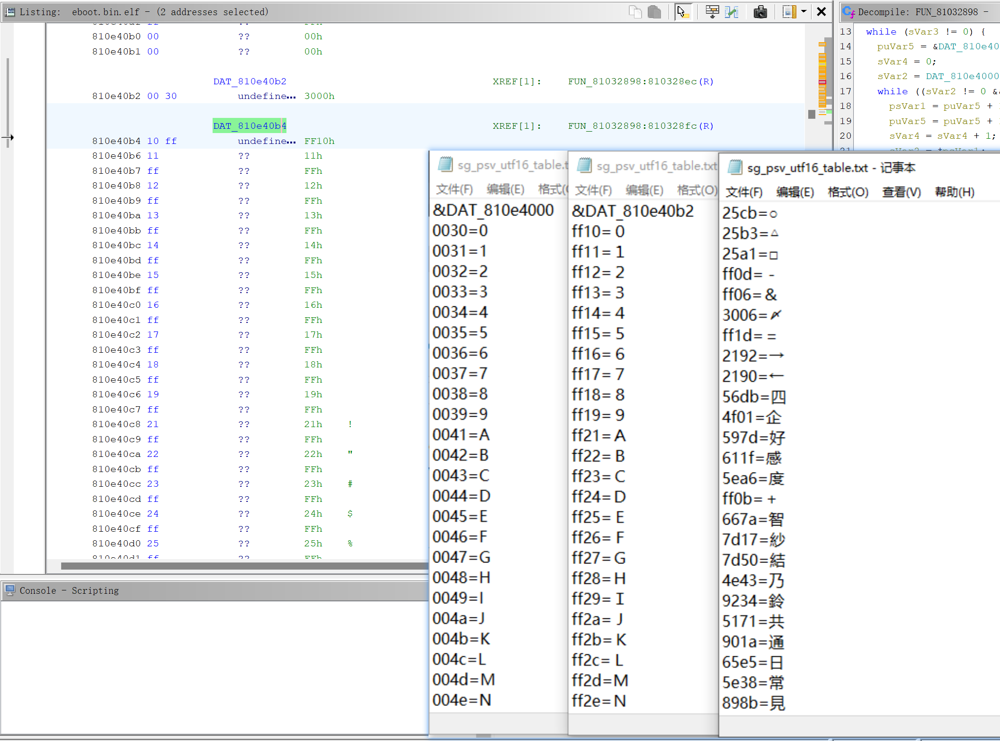</br>提取出来的所有字符文本我顺便保存在了[这里](https://github.com/lzhhzl/sg_psv_localize/blob/main/sg_eboot_utf16le_table.txt)，由于0x810e4000到0x810e40b0终止是通用的半角字符，这一块和Steam版的中文字库开头0x8000-0x8054码位部分的字符基本对应，所以DAT_810e4000表暂且不管。而接下来的DAT_810e40b2表先是从0x810e40b4开始记录psv日文字库第一个全角字符0的utf16-le 2字节值、之后逐次记录到0x810e5562终止，其中复合字符用utf16-le 0x0030来表示，也就是说DAT_810e40b2表大小刚刚好满足psv日文字库中从0x8080码位开始到剩余所有字符映射到utf16-le编码表的数据大小（即41x64+23个字符*2bytes的空间），这样的空间非常吃紧、完全没有代码洞可以利用，要么就只能扩容eboot的.data区块、要么就只能确保Trophy奖杯信息的中文翻译用字(除了半角字符以外)在Steam版中文字库的使用范围是不能超过41x64+23个字符的，但从前面字库处理的观察来看、Steam版中文字库的标点符号和汉字分布霸道庞大且任性，想要限制在psv日文字库这一丁点映射范围极其困难。

虽然从eboot字符串汉化的思路上可以考虑扩容.data区段来写入全新的中文字库映射到utf16-le编码值表，但想到这庞大的中文字符使用数量所需的扩容段页数和调试测试的麻烦程度，最终还是取巧想到了一个魔改FUN_81032898函数的方法：</br>考虑到FUN_81032898函数其实最后的目的就是计算出utf16字符对应游戏字库的字符码是多少，实质就是 utf16字符—>对应在字库中第几个位置的字符—>该字符的码位 的映射计算，其实完全可以不用通过硬查表来实现这一点；前面字库分析中我提到CommitteeOfZero的字库构造工具`mgsfontgen-dx`制作字库的功能逻辑中有一个为了将复合字符映射为单一字符而用到了Unicode中Private Use Area(uE000 到 uF8FF)进行映射的逻辑，这一范围的字符对于utf16和utf8都是可用的，而表DAT_810e4000和表DAT_810e40b2完全没用到这些范围的字符编码值，那其实完全可以将uE000到uF8FF作为计数器映射到每个字库上的位置，即码位0x8000的字符映射记录为uE000、0x8001的字符映射记录为uE001、剩余字符同理，Unicode PUA的范围也足以轻松映射完所有中文字库字符，随后我们只需要将Trophy奖杯信息的原文映射转换到用Unicode PUA来表示，而在eboot的FUN_81032898函数中加入一个可以将Unicode PUA字符逆计算出中文字库对应码位的汇编逻辑即可。</br>通过观察FUN_81032898函数，发现从0x810328e4这里开始匹配DAT_810e40b2表的汇编逻辑过程是可以魔改出空间塞入我构想的新映射计算逻辑的，很幸运的不需要附加新的区段到.text区段，从0x810328e4到0x81032917新修改的汇编代码大致如下：

```asm
        LAB_810328e4  XREF[1]:     810328dc (j)   
    810328e4 44  f2  b2       movw       r0 ,#0x40b2
             00
    810328e8 c8  f2  0e       movt       r0 ,#0x810e
             10
    810328ec 02  88           ldrh       r2 ,[r0 ,#0x0 ]
    810328ee 2b  1c           adds       r3 ,r5 ,#0x0
        LAB_810328f0  XREF[1]:     810328fc (j)   
    810328f0 94  45           cmp        r12 ,r2
    810328f2 04  d0           beq        LAB_810328fe
    810328f4 42  88           ldrh       r2 ,[r0 ,#0x2 ]
    810328f6 02  30           adds       r0 ,#0x2
    810328f8 01  33           adds       r3 ,#0x1
    810328fa 22  45           cmp        r2 ,r4
    810328fc f8  d1           bne        LAB_810328f0
        LAB_810328fe  XREF[1]:     810328f2 (j)   
    810328fe 5f  f4  00       movs.w     r0 ,#0x8000
             40
    81032902 94  45           cmp        r12 ,r2
    81032904 03  d1           bne        LAB_8103290e
    81032906 13  b1           cbz        r3 ,LAB_8103290e
    81032908 7f  33           adds       r3 ,#0x7f
    8103290a c0  18           adds       r0 ,r0 ,r3
    8103290c 04  e0           b          LAB_81032918
        LAB_8103290e  XREF[2]:     81032904 (j) ,  81032906 (j)   
    8103290e bc  f5  60       cmp.w      r12 ,#0xe000
             4f
    81032912 01  d3           bcc        LAB_81032918
    81032914 bc  f5  c0       subs.w     r0 ,r12 ,#0x6000
             40
```

对比起原先0x810328e4到0x81032917的逻辑进行了以下修改：

- 考虑到0x81032918开始就是`uxtb.w r1 ,r0 ,#0x8`、即不论前面r1的作用是什么、只要到了0x81032918开始都会被重置为新的值，于是这里使用了r0取代了r1作为DAT_810e40b2表数据的取地址寄存器，省去了原先0x810328f4处`adds r0 ,r1 ,#0x0`和0x810328f6处`mov r1 ,r0`的重复互换两个寄存器数据的过程；
- 另外可以人工验证的是在0x810328ec处记录DAT_810e40b2表开始的r2在该程序中肯定不是终止符0x0000的值，那么连循环DAT_810e40b2表开始前的0x810328f0处`cmp r2 ,r4`和0x810328f2处的跳转都可以考虑省略掉；
- 最后考虑到r3在0x81032918后都没用用上、后续到循环重新开始便会重置，而r0在0x81032906处就已经重置为0x8000了，于是原0x81032910处和0x81032914处的DAT_810e40b2表映射计算就可以简化为 r3自身的加运算 与 r0和r3的直接加运算；
- 后续省出的空间我塞入了一个用 字符utf16值(r12)-0xe000+0x8000 即 r12-0x6000 的算式逻辑映射计算出中文字库对应字符的实际码位，并用 r12是否大于等于0xe000 的条件作为elif结构跳转到上面新加的映射计算逻辑，这样的好处是既能保留程序原始的硬编码表映射逻辑、换回日文字库也能正常显示，又兼容塞入我的新中文字库映射计算逻辑。

我这里设计的新汇编逻辑有点为了满足我的强迫症所以才加入了兼容原日文字库的结构，通常更简单粗暴的方法可以直接覆盖掉原先日文字库的的表映射计算修改为新的中文字库映射计算，我的方法只是其中一种思路、仅供大家参考。

将新的汇编代码逐一在ghidra中 Patch Instruction 后，通过ghidra Export出修改后的elf，过程中ghidra本身就已经编译好了arm elf，所以接下来只需要将修改好的elf(velf)转换为fself就可以扔回游戏中使用了，这里推荐使用vita-elf-inject或者vitasdk中的`vita-make-fself`转换工具，具体操作方法以后有机会我可能会和dump elf一块写在另一篇博客里，这里暂不过多赘述。

扔入新做好的fself eboot.bin到rePatch中测试日文版，能够正常打开并用日文字库显示trophy。接着需要将TROP.SFM中name和detail标签下的所有日文内容翻译为Steam版中文后全部映射转换为Unicode PUA字符表示，这里我写了一个脚本[sg_trophy_text_convert.py](https://github.com/lzhhzl/sg_psv_localize/blob/main/sg_trophy_text_convert.py)基于前面脚本翻译时用的tbl中文字库表进行统计分析并转换出映射后的文数据注入回SFM，仅作为参考。</br>需要注意的是，由于Unicode PUA字符在utf8中基本上是3字节表示，映射后的文本数据有概率比原文本数据大，修改后的SFM数据也会随之增大，这种情况是不能硬塞入trophy.trp中TROP.SFM的原始数据块一开始的位置的、因为会把TROP.SFM之后的文件数据块偏移给搞乱，通常的解决办法就是写一个trophy.trp的封包脚本重新计算每个文件数据的偏移即可。但我比较懒不想再写一堆轮子了= (゜ω゜)=，个人就采用了将修改后的TROP.SFM数据块插入到trophy.trp尾部、并修改TROP.SFM的偏移值和偏移量的方法：</br>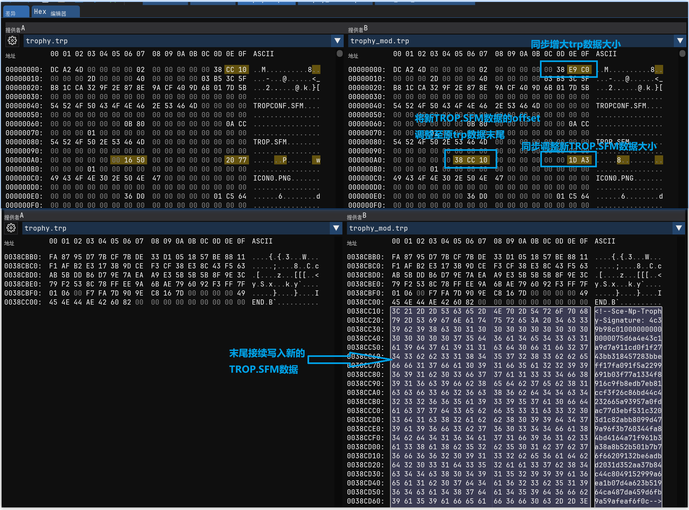</br>注意要计算好开头和结尾要补充的padding、并算入到trp size中，之后扔回rePatch运行游戏，成功显示出中文：</br>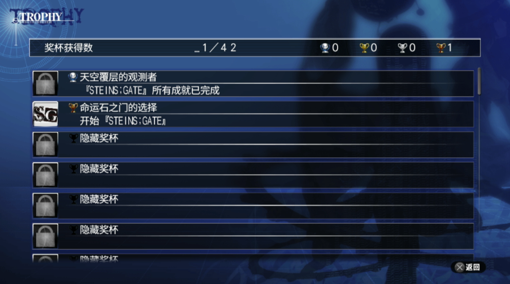

本次汉化SG trophy的内容也是费了不少功夫，虽然作用小但是也学习到了不少该引擎的细节，甚至还误打误撞找到了[eboot中记录着日文字库字符对应utf16-le值的位置，其他的psv石头门作品完全可以按照类似思路来提取这些值来作为字库字符及tbl制作的参考][#sec-1]。就此，psv Steins;Gate 的汉化分析与准备也大致完成了。接下来是封包和视频素材的汉化拓展记录。

## 拓展：USM视频文件的简单分析和再制作

接下来的这几个部分算是我的另外发现吧。一开始我是没考虑要移植视频的，但试玩了Steam石头门的过程中发现开场的两个动画是配有中文字幕的，出于好奇心还是了解了一下Steam PC和psv两作的视频格式。首先Steam版的使用的是bk2封装格式、是一家叫RAD Game Tool的公司组制作的一种Bink Video Codec for Games，他们家的官网上也提供了可免费下载的[The RAD Video Tools](https://www.radgametools.com/bnkdown.htm)工具可用于查看转换bk2格式的视频素材、并将其他格式视频制作bk2格式。</br>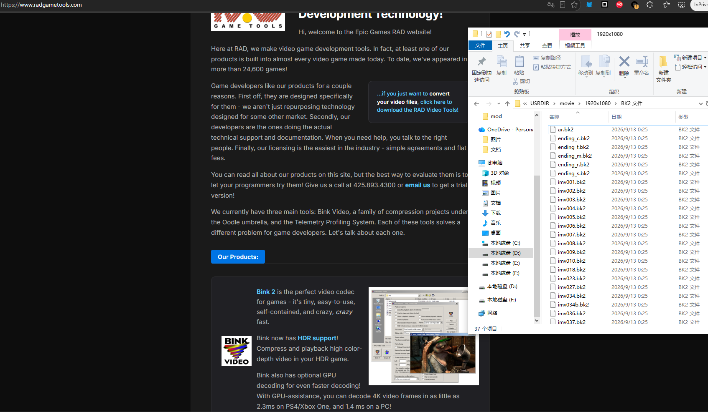</br>而psv使用的视频素材则是USM格式，这是CRIWARE这家游戏中间件公司自己的Codec，其中音频流通常也是CRI自家的ADX、HCA音频格式，视频流大多使用AVC编码，我找到的大部分资料都推荐使用VGMToolBox和WannaCRI进行解封装、以获得视频流和音频流。但这些工具仅仅也只能做到解封、却迟迟没有找到一个办法可以直接将mp4一类的常规格式制作回USM。这也是我一开始迟迟没有考虑视频移植的原因。

直到后来在一次外网冲浪的过程中，我偶然间发现了以下几个资料

- 对USM文件的加密与解密研究 https://manalogues.com/posts/2024/02/28
- 重建索尼克失落世界的USM https://gamebanana.com/tuts/19223
- P5R 修改指南 动画场景（USM）https://shrinefox.com/blog/2025/10/16/p5r-modding-guide-2025-7-anime-cutscenes-usm/
- NieRAutomata-LodMod H264 encoding - Criware/Scaleform SDK request https://github.com/emoose/NieRAutomata-LodMod/issues/8

其中最重要的是第三个P5R的USM动画mod修改教程和第四个Niel LodMod H264-USMs制作问题，他们总共提到了：

1. [Scaleform VideoEncoder](https://www.nexusmods.com/witcher3/mods/3505) A Criware tool for converting .avi movie files to .usm files that are supported by the game。
2. [new-criware-sdk xx-Version](https://archive.org/details/new-criware-sdk) 一个于23年留存在Internet Archive的公开Criware SDK。
3. [Autodesk-Scaleform-GFx-SDK](https://github.com/Final-Game-Production-Inc/Autodesk-Scaleform-GFx-SDK) Autodesk Scaleform, A 3A Game UI Designing With Adobe Animate Or Adobe Flash, Audio For FMOD & WWISE, And Sofdec2 For Video.

其中的Scaleform VideoEncoder作为Criware推出的官方工具，我也下载来尝试了一下、确实能制作出USM视频、但缺陷是只能制作出1920*1080等标准大分辨率的格式视频，基本上无法做出psv、psp时代那种小分辨率的视频，多用于PC、PS4时期等大型游戏的视频制作。遂尝试下载了new-criware-sdk来碰碰运气，通过CRIWARE_SDK_v2_19_03_PC安装并放入许可证 Crack后惊喜的发现、其中Tools不仅涵盖了CRI官方的ADX2音频处理工具和Sofdec2视频处理套件工具，还留有了crifilesystem的封包查看和制作工具。打开Sofdec2EncWiz发现PlayStation Vita平台的制作选项刚好位列其中：</br>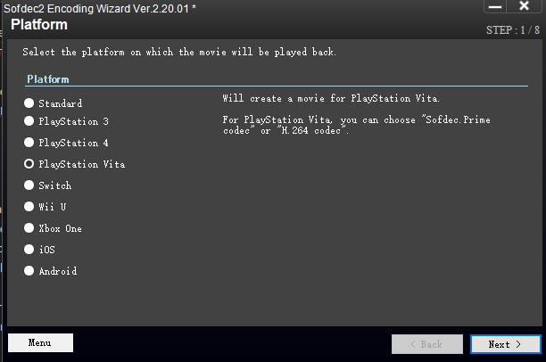</br>于是便着手尝试用Steam版1920x1080的bk2转mp4的视频素材进行转换制作，需要注意的是由于psv上的USM视频素材是960x544这种非标准16:9的分辨率、而1920x1080这种标准16:9的视频貌似并不适合直接强硬缩放拉伸到960x544这个大小，所以在使用ffmpeg进行缩放的过程中我使用了-vf "scale=960:544:force_original_aspect_ratio=decrease,pad=960:544:(ow-iw)/2:(oh-ih)/2"这个黑边填充参数以缩小适应到不标准的960x544比例，其次在Sofdec2的Video配置中我选用了H.264 Video Codec，虽然大部分的mod制作例子中都提到了VP9，但制作psv平台的视频时选用这个参数工具就会提示`VP9 video codec is supported for Standard, Swtich, iOS and Android platforms. Select platform supported VP9 video codec.`并强制退到其他可用的Codec。</br>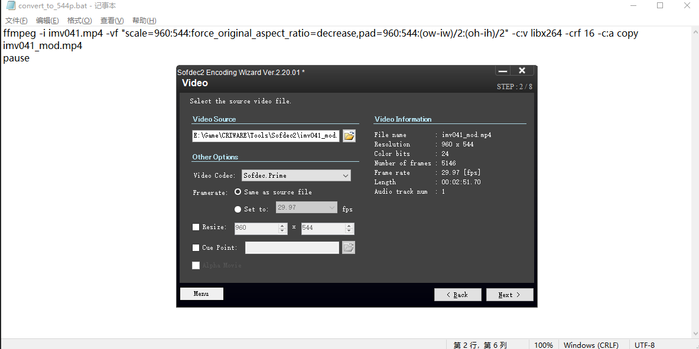</br>之后的选项都是保持默认，一路按到Encoding界面、点击Start启动转换，等待成功后用Sofdec2Viewer打开得到的USM视频，成功播放出视频和音频。</br>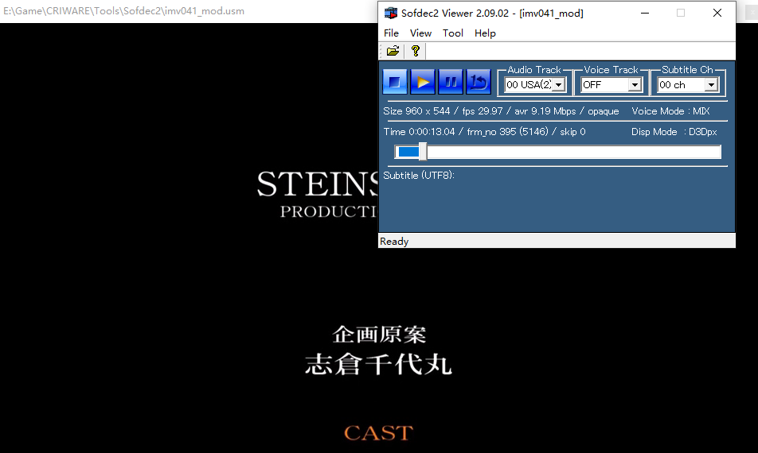</br>

## 拓展：CPK资源封包的另一种方法

刚好在上面USM视频的制作中提到了[new-criware-sdk](https://archive.org/details/new-criware-sdk) CRIWARE_SDK_v2_19_03_PC中内含的crifilesystem 封包系列工具，接下来一并学学该如何使用。

crifilesystem 全称 CRI File System Tools，其内含的CRI_File_System_Tools_Manual_e电子说明书指出、实际包含可用的有CPK File Builder和CRI Packed File Maker两个GUI工具以及“console version CRI Packed File Maker”(cpkmakec.exe)一个被实际调用的命令行工具。</br>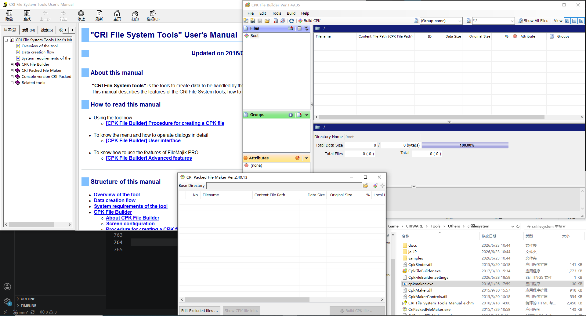</br>其中CRI Packed File Maker较为简单易用，可以打开查看任意CPK内的内容设置属性以及基于文件目录再制作CPK。</br>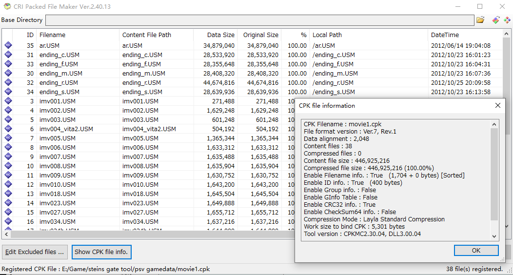

从封包内的文件窗口中可以得知有以下几个属性展示：
| Name of column | Description |
| :--- | :--- |
| **(1) Uncompressed/Compressed status 是否压缩** | Shows the icon indicating the uncompressed or compressed status.<br>For an uncompressed file, a blue icon is shown, and for a compressed file, a red icon. |
| **(2) No. (ID) 文件对应ID** | Shows the entry number of the file.<br>If the file ID information is valid, "ID" is shown with the file ID. |
| **(3) Filename 文件名(如果有记录)** | Shows the file name.<br>This information is not shown for a CPK file having only the file ID information. |
| **(4) Content File Path** | Shows the file path within the CPK file. |
| **(5) Data Size 实际存储数据大小** | Shows the data size within the CPK file.<br>If the file is compressed, the size of the compressed file is shown. |
| **(6) Original Size 原始文件数据大小** | Shows the data size before the file is compressed is shown. |
| **(7) % 压缩率** | Shows the compressibility of the file. |
| **(8) Local Path** | Shows the file path on a local PC. |
| **(9) DateTime** | Shows the update time and date of the file. |

而制作封包界面的窗口可设置数据块的对齐大小、文件信息保存模式（信息格式，如是否只保存文件名或者文件名和ID一并保存）、是否压缩、是否混淆文件信息、是否输出ID信息定义的头文件“.h”。但美中不足的是还缺少对`Enable Group info`、`Enable GInfo Table`、`Enable CRC32 info`、`Enable CheckSum64 info`的配置。</br>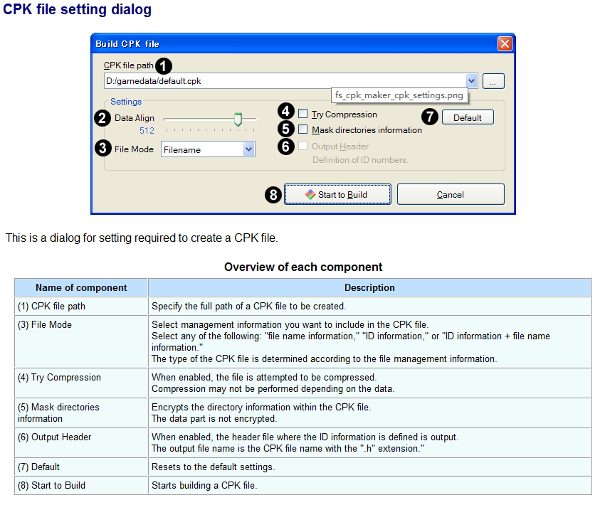

为了制作和psv石头门原版一模一样的封包，CRC32 info的保留还是有必要的于是接着再来看看功能更为全面的Cpk File Builder。</br>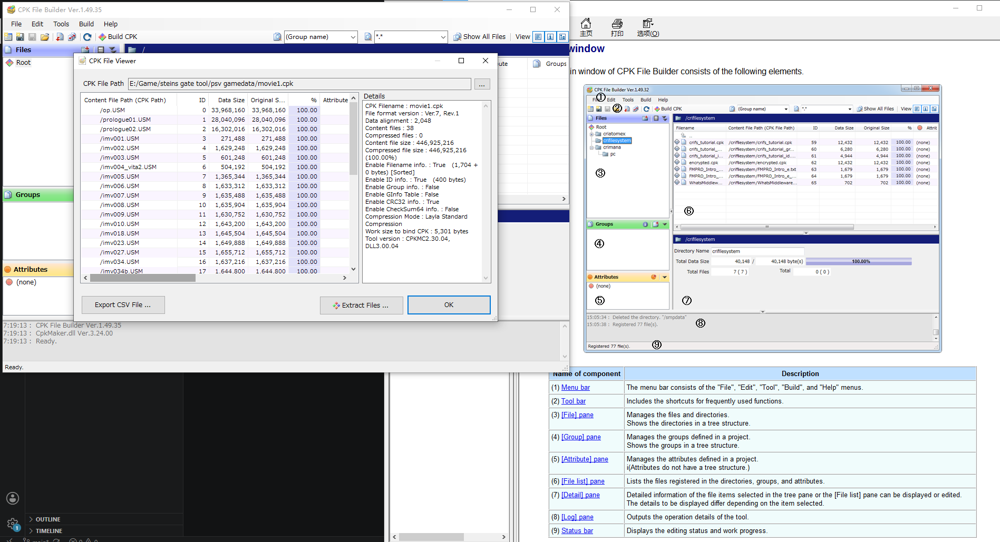</br>Cpk File Builder的解包功能与CRI Packed File Maker几乎无异，比较特别的是它多了一个`Export CSV File`的功能，这个功能在封包时非常有用、能控制封包中文件信息的很多细节。以movie1这个携带了文件名信息的封包为例子，将解包后的文件夹载入窗口中：</br>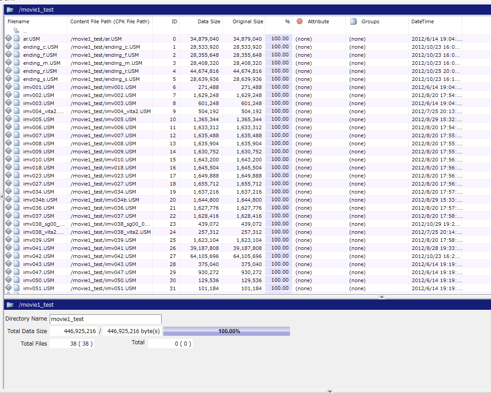</br>可以看到文件信息列表有这几个属性：
| Name of Column | Description |
| :--- | :--- |
| Filename</br>文件名 | Displays the file name. </br>The icon shown before the file name shows the compression setting or indication of a file or shortcut. |
|Content file path (CPK file path)</br>文件载入相对路径 | Shows the file path in the CPK file. |
| ID</br>文件ID | File ID. </br>The file ID can be used for a CPK file with file ID information. |
| Data size</br>封包内文件存储数据大小 | Shows the data size in the CPK file.</br>If the file is compressed, the size of the compressed file is shown. |
| Original size</br>文件原始数据大小 | Shows the data size before the file is compressed. |
| %</br>压缩率 | Shows the compression ratio of the file in percentage.</br>This may be shown in graph depending on the compression ratio. |
| Attribute | Shows the attribute assigned to the file. |
| Group | Group where the file belong. The file can belong to multiple groups. |
| Date time | The time stamp of the file. |

通常也可以通过CSV文件来导入你要封包的文件，但如果要用前面提到的导出封包的csv的话、需要注意的一个坑点是Cpk File Builder解包窗口导出的csv其实是按照“路径1，ID，Data Size，Original size，压缩率，Attribute，Group，Date time，路径2”这样的文件表头排列的：</br>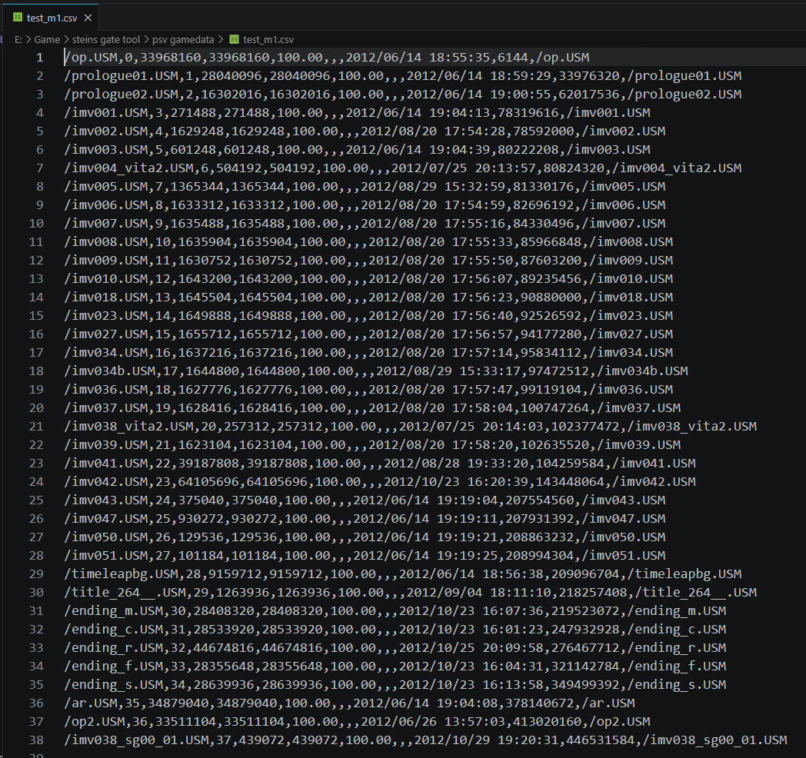</br>很明显这样的列表和Cpk File Builder 文件信息列表的表头是对不上的且有多余列的，需要自行调整。之后封包也和CRI Packed File Maker类似，但是多了更多控制细节，其中就包括了CPK封包内常见的同名文件共存处理和CRC数据写入的设置：</br>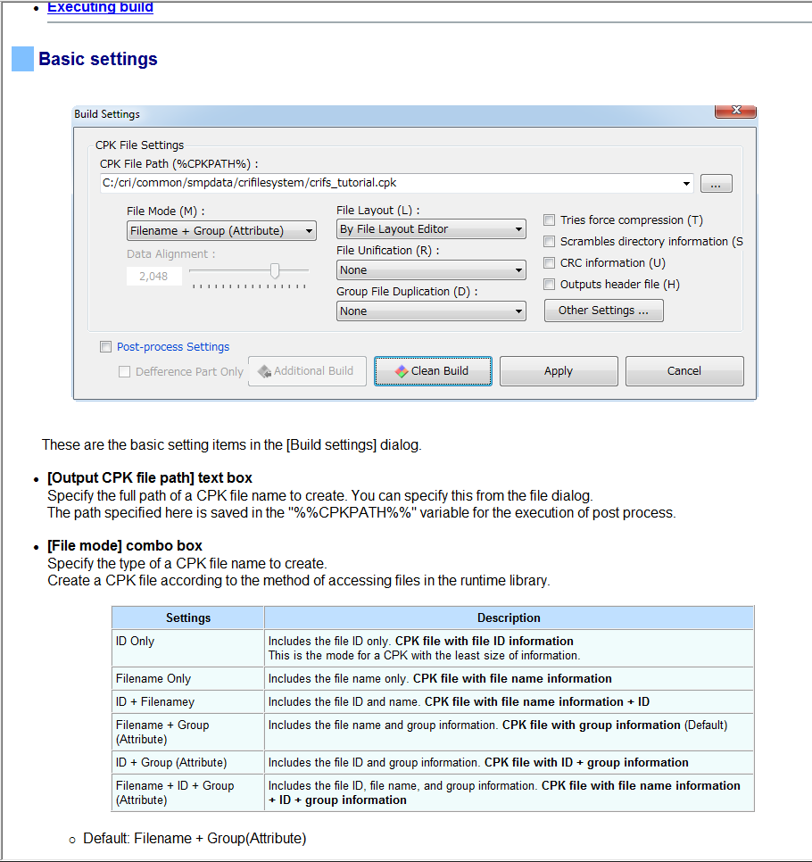</br>个人在实际使用发现虽然Cpk File Builder更系统化更详细，但它还是更适用于制作开发游戏项目时使用，尤其是要导入的CSV经常要写好待封存文件在电脑上的准确路径、才能在创建封包时正常读取并封存，一套流程下来对于汉化这种多数情况是replace封包内文件数据的操作来说还是有点太复杂了，最后在我汉化的过程中还是选用了命令行工具`Console version CRI Packed File Maker`（cpkmakec.exe和CpkMaker.dll）:</br>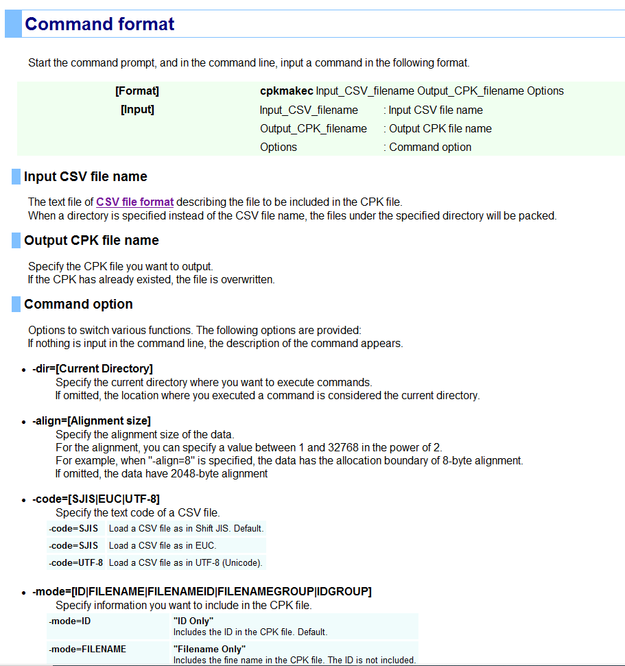</br>cpkmakec简单易用且高度定制化，命令行提供的参数基本涵盖了Cpk File Builder中大多数会用到的封包设置选项，并且只需要基于非常简单的 “File path name, content file name, ID, Compress/Uncompress” 表头csv就能够快速进行封包：</br>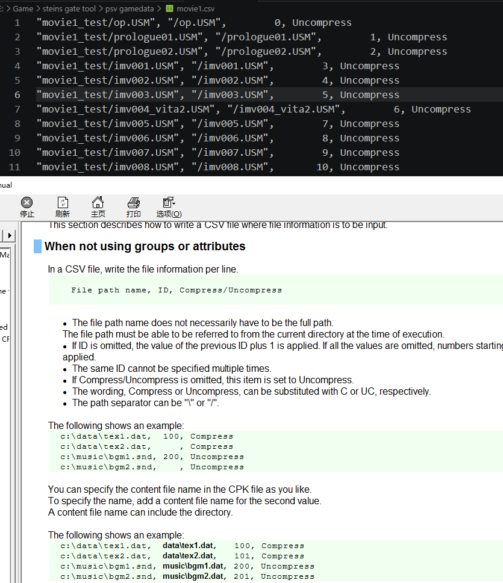</br>我个人常用的封包命令是：
```
cpkmakec.exe [pack csv] [new cpk path] -align=2048 -code=UTF-8 -mode=[ID\FILENAMEID] [-crc] [-mask]
```
但不同游戏的封包设置都各有不同，建议对照CRI Packed File Maker或Cpk File Builder的封包文件信息进行自定义还原，相关参数和使用例子在工具内的说明书已经描述的很详细了、这里就不过多赘述，欢迎各位在汉化中不断挖掘和探索。
