# psv unity游戏汉化随记1：Rear Pheles-Red of Another 字库分析

最近摸鱼的时候偶然瞥见了贴吧一位朋友汉化psv unity VN类游戏需要找到并修改字库的[需求](https://tieba.baidu.com/p/10257977638?pid=152918177673&cid=#152918177673)案例，想着之后自己也有着一两款想在psv上打算汉化的unity VN游戏、出于好奇心就拿来试着练练手。

游戏是 `PCSG00663` `Rear Pheles-Red of Another`(简称Rear Pheles)，下载安装好后首先直接打开看看游戏文件结构，Media目录下清一色的标准unity项目结构，好在也不是il2cpp(global-metadata.dat)或者日厂VN会魔改过的文件结构，直接上unity分析三剑客：dnSpy、AssetStudio、UABEA。 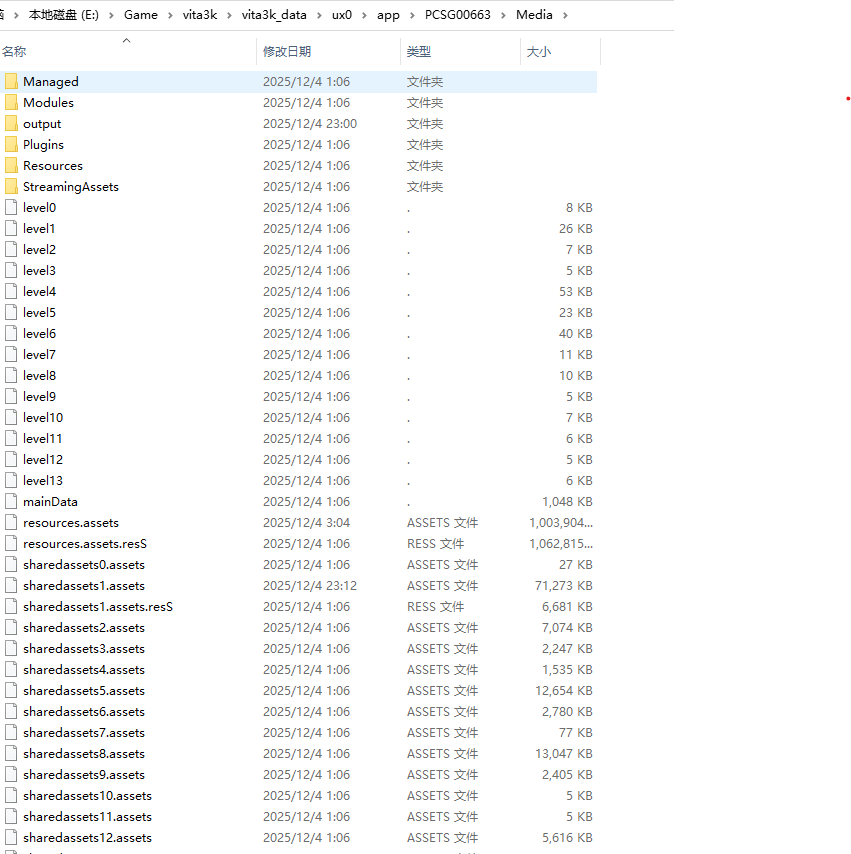

由于楼主已经找到文本了，那重点就放在寻找游戏字库上，u3d游戏通常会用到unity default font(ttf、otf一类)、TMP、NGUI这三类字库，在一些unity VN类游戏中也存在有压缩、swizzle过的自定义字库，只能先看看各个assets中有没有眼熟的东东。用AssetStudio先载入游戏中的各个assets，大致能推断出该游戏的level类文件只包含了可能每个路线故事演出中必要的非文本相关文件，那就直接在最大的resources.assets中找找，能看到包含了各种游戏用到的Texture、Text Assets和Font Assets: 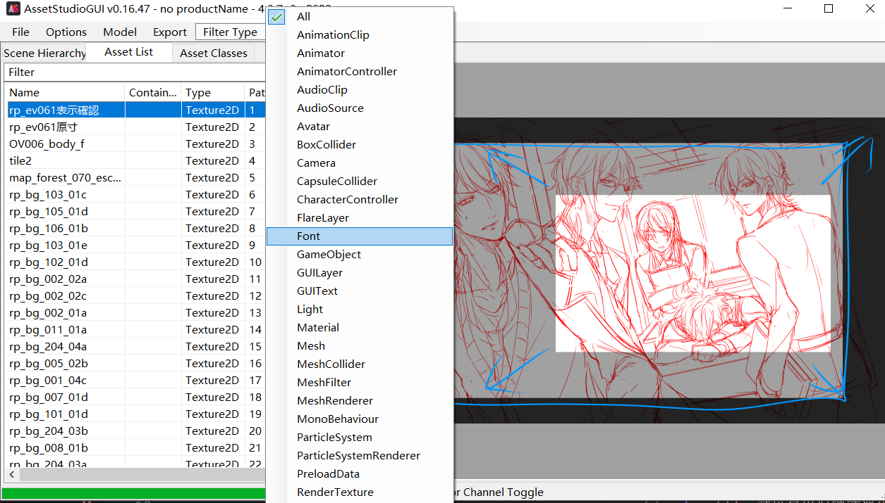

撞撞运气看看Font相关的asset，能找到几个font文件，对比一下游戏开篇文本的模样，能看出来大概是用的这个 TT_Budo-L 的字库，实质是unity default font，可以作为ttf导出来，定位到是在sharedassets1这个assets中PathID为24的位置，那看来需要替换的字库不那么复杂了。 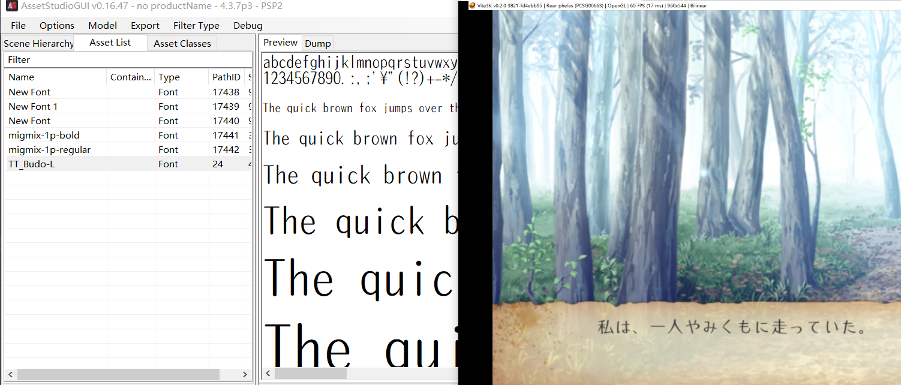

既然知道了需要修改字库的位置，那接着导出ttf字库文件做修改并替换回去相关的assets估计就差不多了。关于Unity的Unity Default Font(UGUI)字库的修改，我参考的是B站[Icetric冰介](https://www.bilibili.com/video/BV1Pa411w79B)和[埋四水和饼饼](https://www.bilibili.com/video/BV1jSocYmEws)这两位大佬Up的字体修改教程及实操演示，其原理基本都是差不多的，首先依照Icetric冰介大佬的方法、试着用UnityEx去导入这个游戏的sharedassets1并dump出当前assets中所有的ttf文件，可通过打开ttf观察或者在游戏开头文本中修改写入常用的简中文本来观察游戏文本原字体是否支持简中范围字符（通常日文字体只是支持到了一些Unicode中部分与简繁中文使用相同的汉字，但对于实际的简中翻译来说编码范围肯定还是不够用的），如果该游戏日文所用的字体并没有支持到简中编码范围的字符，就需要使用`Icetric冰介`大佬提供的`字体合并补全工具`[^1]将游戏文本所用字体进行补全或和其他简中字体合并，然后将生成的新字体重命名成游戏文本字体名后、替换掉在UnityEx生成替换用目录Unity_Assets_Files中的ttf同名字体文件即可；但不知为何我使用这个方法并没能成功修改出该游戏正常可用的字库，后续一阵对比发现，原因可能就在于在UnityEx dump出的TT_Budo-L.font_raw字库资源分成了一个ttf文件和一个ufnt文件： 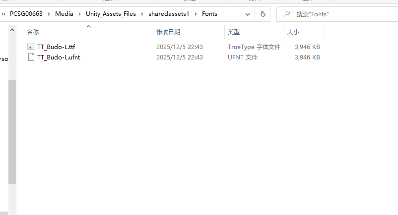 ufnt文件应该基本包含了字体载入在Unity中的相关设置和描述信息、以及ttf原始数据，但实际在UnityEx导入回这两个修改文件的过程中，先会生成TT_Budo-L.font_raw这个完整的原始Font资源文件、之后再对assets中的数据进行替换，而这个原始资源文件似乎并不能自动根据修改过的游戏字体文件准确修改出可用的TT_Budo-L.font_raw，个人多次尝试也没能成功。

接着打算尝试Up埋四水和饼饼使用的UABEA字库导入导出插件替换ttf文件的方法，结果打开sharedassets1发现UABEA没能读取出来其中的文件，而打开resources会报以下错误： 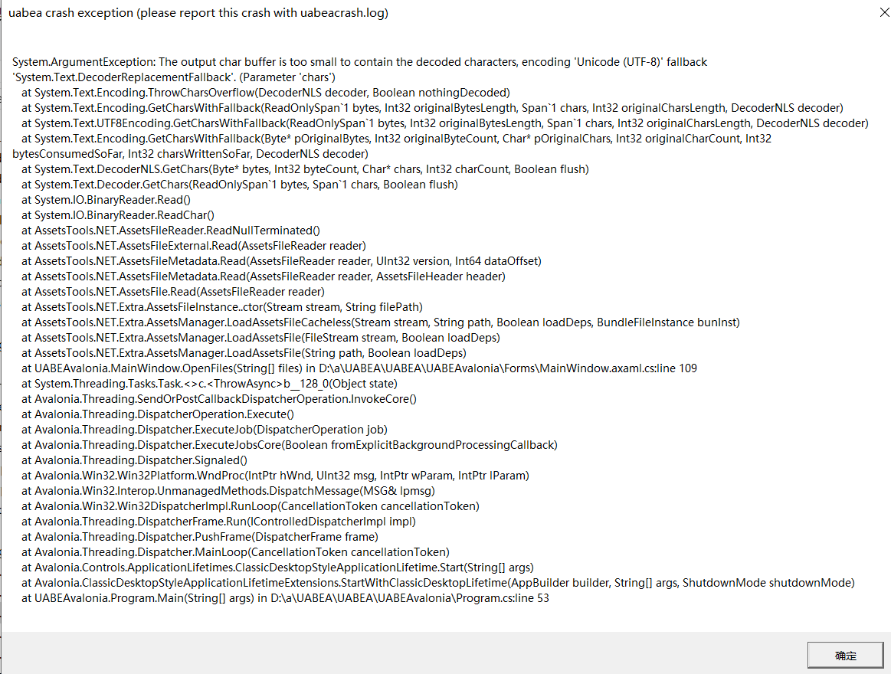 根据错误找到了[UABEA相关ISSUES的说明](https://github.com/nesrak1/UABEA/issues/210)，原来是因为该游戏的Unity构建版本是4.3.7p3比较偏旧一些的版本了、而UABEA是为了支持更新版本的Unity设计的，所以作者还是建议用回[UABE-AssetBundle Extractor](https://github.com/SeriousCache/UABE)进行修改。那就改用UABE试试，打开sharedassets1尝试导出TT_Budo-L对应的ttf文件，发现UABE原先并没有设计用于导出导入Font资源用的插件，没办法只好把思路转向了能否分析并修改TT_Budo-L对应的UGUI font raw数据，UABE导出(Export Raw)`TT_Budo_L-sharedassets1.assets-24.dat`Raw数据，扔进Imhex(用任何一种16进制编辑器都行)观察，发现从0x48起的数据正好和AssetStudio导出的TT_Budo-L.ttf数据开头一致，原先的TT_Budo-L.ttf数据大小为0x3DA604，对应TT_Budo_L dat RAW数据从0x48向后0x3DA604 byte进行追溯，最终发现原来TT_Budo-L Font资源数据实则是在TT_Budo-L.ttf数据的基础上、在前面开头添加了0x48大小的可变长描述信息数据、以及在后面结尾添加了0x28大小的可变长描述信息数据。那看来最主要的修改就是将其中原始ttf的数据部分替换成新的ttf数据。 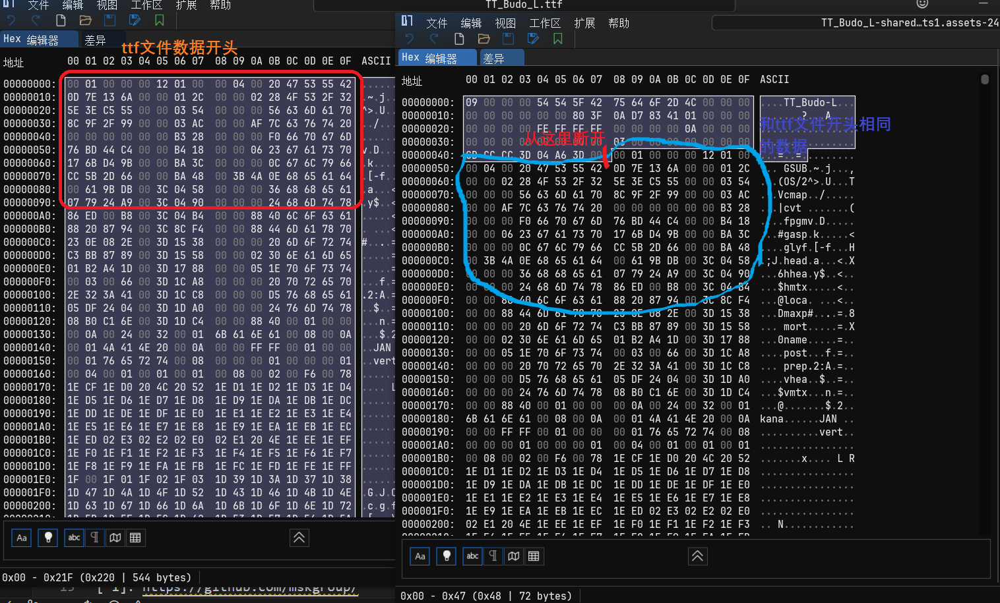 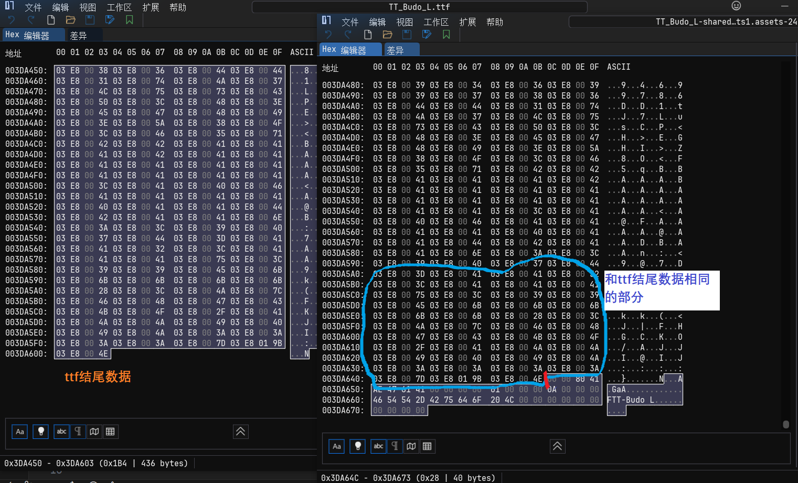

初次尝试只是把`TT_Budo_L-sharedassets1.assets-24.dat`中0x3DA604大小的ttf数据全部覆盖修改并扩展替换成新的ttf数据，结果扔进游戏里还是不行。后来在网上搜索资料的过程中发现了这两篇文章：

> https://www.cnblogs.com/guobaoxu/p/12060027.html https://www.bilibili.com/opus/914075886494416905

由此了解到到了unity导入了ttf后生成的资源大致结构，这里以UABE用View Data模式查看sharedassets1中TT_Budo-L的资源为例： 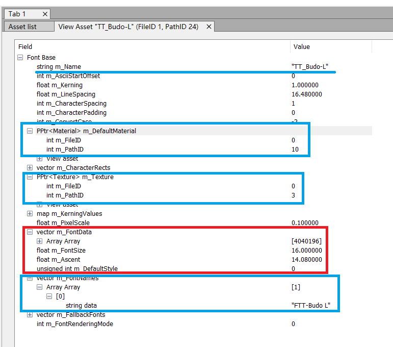 可以看到Font Base中m_Name定义了资源名`TT_Budo-L`、m_FontNames存储了实际的字体名`FTT-Budo L`，以及Font相关联的指向Font Material的指针（指向PathID 10）和指向Font Texture（指向PathID 3）的指针，最后是重点的ttf实际数据部分m_FontData，其中ttf文件的二进制数据以Array对象存储着，而Array对象的大小4040196正好对应着TT_Budo-L.ttf文件的实际大小0x3DA604 bytes。而看回原先的`TT_Budo_L-sharedassets1.assets-24.dat`，可以发现在实际的ttf数据存储前4个字节(0x44-0x47)`04 A6 3D 00`刚好是TT_Budo-L.ttf文件大小0x3DA604的小端序表示 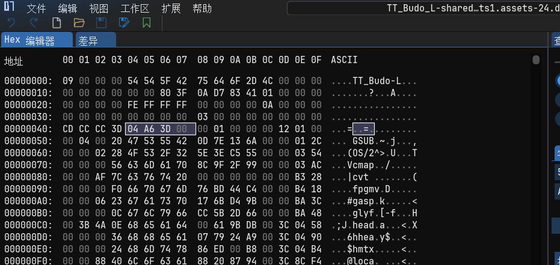

在不变动原先Font资源的m_Name、m_FontNames、Material、Texture等结构信息的前提下，看来只需要将dat文件中m_FontData指向的原始的ttf数据替换为新的ttf数据、并将此前4字节的ttf数据大小修改写入为新的ttf数据大小即可。这里我用`字体合并补全工具`[^1]对游戏文本原日文字体进行补全的新字体out.ttf为例（大小0xCCF76C）：

- 首先将`TT_Budo_L-sharedassets1.assets-24.dat`前0x48 bytes的数据截取到一个新文件中： 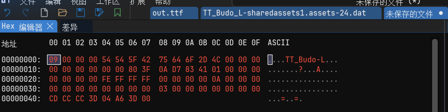 并将0x44-0x47部分的`04 A6 3D 00`改成待会拼接过来的out.ttf数据的大小0xCCF76C，注意要修改写入的是0xCCF76C的小端序表示`6C F7 CC 00`： 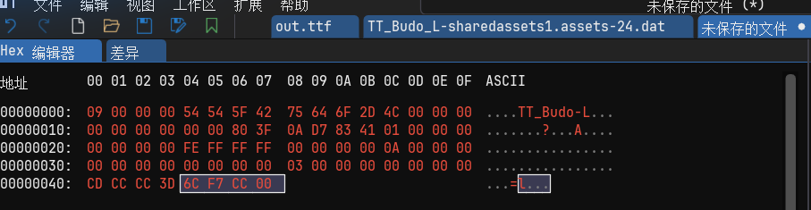

- 接着将out.ttf数据拼接到新文件的末尾： 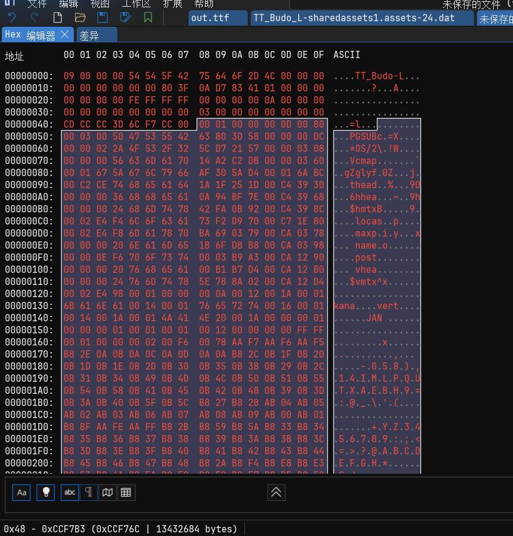

- 随后再将`TT_Budo_L-sharedassets1.assets-24.dat`结尾(0x3DA64C-0x3DA673)处的结构描述数据拼接到新文件的末尾： 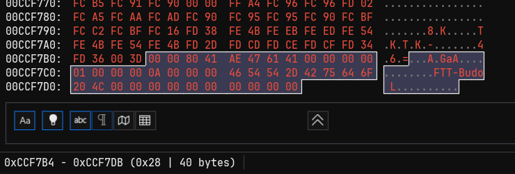 并保存新文件为`TT_Budo_L-sharedassets1.assets-24.dat`同名文件即可（注意先将原文件备份）

将新生成的`TT_Budo_L-sharedassets1.assets-24.dat`通过UABE `Import Raw`导入到对应的TT_Budo-L 资源处，选择 `Apply and Save all`生成新的sharedassets1.assets，替换掉Rear Pheles游戏中的相应文件（vita3k建议先备份原文件再在原文件路径直接替换，vita实机的NNP游戏需要通过repatch插件构造类似路径进行补丁应用），运行游戏，最终成功显示出修改过的文本中的简中部分： 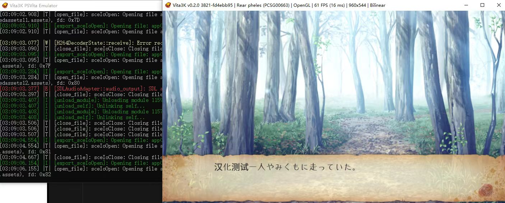

总结：以上通过对一个psv unity vn游戏案例的字库分析，了解了Unity Default Font(UGUI)字库的大致结构，受限于支持旧版unity的UABE(AssetBundle Extractor)不同于新版的UABEA、缺少可以直接导入导出处理字库的插件，个人使用的修改字库的方法也只是其中一种，其实质也是在不使用到Unity的情况下、仿照修改出一个新的可用字库资源文件，当然如果有unity的前提下也可以像[这篇文章](https://www.cnblogs.com/guobaoxu/p/12060027.html)中所介绍的通过修改m_Name信息及修改Material和Texture两个指针指向信息的方法将新的字库资源文件部分结构信息还原成原先字体资源的结构再导入。当然也可以通过编写简单脚本合并替换新的ttf文件数据到原先的字体资源文件中，本文只是介绍了核心的思路。

另外关于更老一点的Unity版本可能会用到的CustomFont，[这篇文章](https://www.bilibili.com/opus/914075886494416905)也有详细的解决方法，其原理和结构与本次案例中的TTF UGUI RAW数据很相似，但是多出了对Material和Texture两个指针指向文件的提取和修改过程，感兴趣的朋友也可以了解一下。

另外，由于AssetStudio原仓库已停止维护，这里也列出来两个个人认为比较好用的近期还在维护的AssetStudio：

> https://github.com/aelurum/AssetStudio https://github.com/zhangjiequan/AssetStudio

[^1]: https://github.com/mskgroup/Unity-Game-localization-tutorial-and-toolkit
